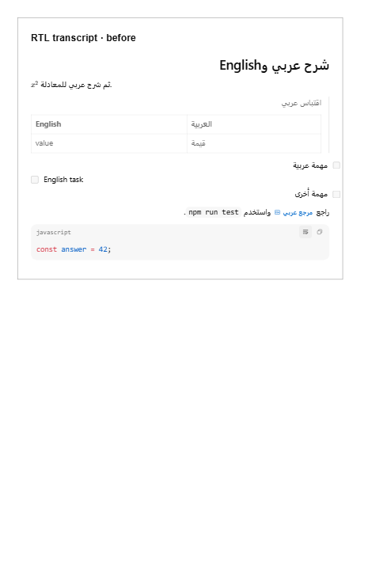
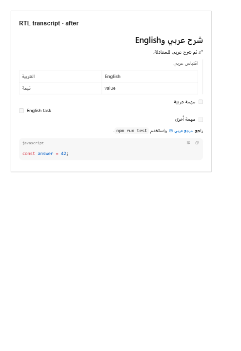

# RTL transcript merge regression evidence

Integrates upstream `71862f9b` into PR #1072 while preserving Wiki link labels, source offsets, dollar/math parsing and file targets. The repair keeps formula-leading Arabic prose RTL, preserves source table column order inside RTL owners, and reserves gutters for mixed-direction task lists.

Synthetic browser fixtures use the renderer and stylesheet from PR head `29d8b082` for **before**, and the repaired renderer and stylesheet for **after**, against the same installed dependencies. They contain no user conversation data.

| Before                                                                                                     | After                                                                          |
| ---------------------------------------------------------------------------------------------------------- | ------------------------------------------------------------------------------ |
|  |  |

[Streaming and wrap-state recording](streaming.webm) · [Settled streaming result](after-streaming.png)

## Verification

Windows, repository-pinned Bun 1.4.2 and Node 24.19.0, frozen lockfile.

- Focused unit checks: 189 passed in the initial pass.
- Focused renderer/Composer/find/streaming/file-action browser checks: 42 passed, covering both direction modes.
- Final full web unit suite: **4496 passed, 3 skipped** (352 files).
- Final full stable browser suite: **441 passed, 13 skipped** (83 files).
- Format, lint (0 errors), typecheck (7 workspace tasks), and desktop build (4 tasks): passed.
- Visual capture and streaming assertions: 2 passed.
- No unresolved merge conflicts; diff whitespace checks passed.

The root `bun run test` did **not** pass on Windows. These four failures were reproduced independently on unmodified upstream `71862f9b`:

- `scripts/canary.test.ts`: two Unix-path expectations differ from Windows path resolution.
- `packages/shared/src/loginShellEnvironment.test.ts`: expected cache path omits the Windows drive prefix.
- `apps/desktop/src/browserSessionPolicy.test.ts`: fixture file URL is not absolute on Windows.

These files and their implementations are unchanged from upstream. Turbo stopped the workspace run after failure; this is not a claim that every remaining package passed. The web package was subsequently run to completion separately.

The stable browser run logged a ResizeObserver notification in ChatView. The same notification reproduced in the focused upstream baseline test, which passed. Both final browser commands exited successfully. Lint and existing browser harness warnings are not represented as silent clean logs.

Full GitHub CI on the updated PR head/merge ref is still required before upstream merge. Metadata checks alone do not establish that result.
