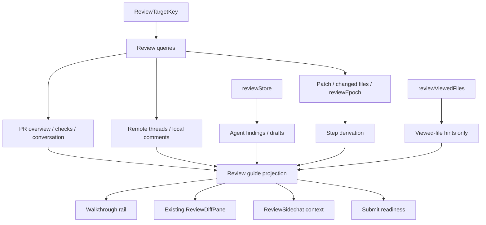
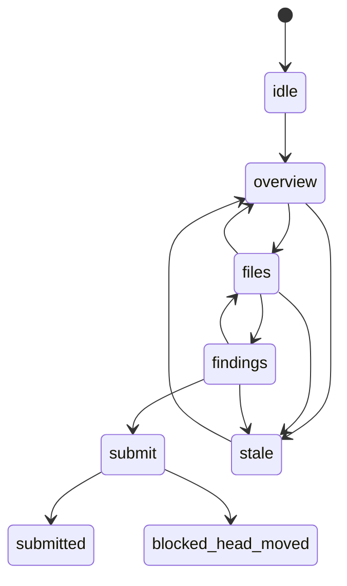

# Guided review walkthroughs for PR and branch reviews

## Summary

Add a guided review walkthrough layer on top of Synara's existing PR and branch review surface. The first version should help a reviewer answer "what should I look at next?", preserve progress per review target and changeset epoch, turn agent findings into anchored comments, and guard against stale feedback before submit.

This is the next phase of the PR review work. The older "full PR review" baseline is now mostly present in the code: PR overview, checks, conversation, changeset loading, comments, remote threads, agent findings, review cache, and guarded submit flows all exist as implementation anchors. This plan builds the guided operating loop on top of that foundation.

---

## Problem Frame

Synara can show a reviewer the material needed for a real review, but large AI-generated or agent-assisted changes still force humans to reconstruct the review order themselves. Raw diffs answer "what changed?" better than they answer "how should I review this?"

Stage's strong product move is organizing a change into a story: prologue, review focus, chapters, and risk areas. Codiff's strong product move is a calm local review surface with viewed state, commandable review actions, inline notes, and agent-generated walkthroughs. Synara should not clone either product. It should turn review into an operating loop:

```text
Open review
  -> understand why this change exists
  -> inspect the risky or foundational work first
  -> ask an agent in context when stuck
  -> save anchored comments
  -> submit only when the diff is still fresh
```

The key trust constraint is freshness. Existing viewed-file state is keyed by target, not head SHA, so it can survive a force-push for the same file path. Branch-range reviews are even riskier because their current target identity is branch-name based. Walkthrough progress must be separate from viewed files and scoped to a concrete changeset epoch, never to target identity alone.

---

## Requirements

**Walkthrough orientation**

- R1. A review target must expose a prologue with concise purpose, changed-shape summary, risk summary, and recommended review order.
- R2. The walkthrough must work for GitHub PR reviews and branch-range reviews, with PR-only metadata hidden when no PR exists.
- R3. The prologue must label generated guidance as review orientation, not as an approval or rejection verdict.
- R4. The reviewer must be able to start, pause, resume, and reset walkthrough progress for a target and changeset epoch.

**Progress and navigation**

- R5. Review progress must be keyed by `ReviewTargetKey` plus a required `reviewEpoch`; PR reviews use the PR `headSha`, and branch-range reviews must resolve a concrete epoch such as `baseSha/headSha/mergeBaseSha` or a patch hash.
- R6. Walkthrough progress must not reuse viewed-file state; selected file, viewed file, current step, skipped step, and completed step are separate concepts.
- R7. File state must support at least `unseen`, `open`, `completed`, `skipped`, and `followup`.
- R8. MVP step IDs must be stable across cache refreshes for the same review epoch. File-level steps use path and epoch only; hunk/finding-level steps are allowed only after stable hunk refs and finding keys exist.
- R9. The walkthrough must provide next/previous navigation through a risk-ordered queue without breaking direct file selection in the existing file tree.
- R10. Existing viewed-file behavior must remain compatible with the walkthrough without becoming submit-readiness truth.
- R11. The reviewer must be able to demote noisy files without hiding them entirely.

**Agent and comment loop**

- R12. Agent findings must appear in walkthrough context and keep their current inline annotation behavior.
- R13. A reviewer must be able to convert an agent finding into a local inline comment, dismiss it, skip the step, or mark the related file for follow-up.
- R14. The review sidechat must receive walkthrough context: active step, selected file, progress, risky files, unresolved drafts, and stale/epoch state.
- R15. Walkthrough-generated or agent-generated inline comments must flow through the existing anchored local-comment and review-submit paths.

**Freshness and trust**

- R16. The walkthrough must track the `reviewEpoch` used for derived steps, generated guidance, agent findings, and submit readiness.
- R17. If a PR head or branch-range epoch changes, walkthrough guidance and step progress must reset or reconcile explicitly before the user continues.
- R18. `review.updated` cache refreshes for the same review epoch must preserve matching stable step IDs and drop only stale/missing steps.
- R19. Timeline events must not be used as the source of truth for stale/head detection; use `reviewEpoch` derived from current changeset data.
- R20. Generated chapters, when added later, must prove every included hunk maps to the current diff and every current hunk is either assigned to one chapter or visible in an "Other changes" bucket.
- R21. Ignored or demoted files must remain visible in an "Other changes" or "Demoted" group so no diff content disappears silently.

**Performance and accessibility**

- R22. The walkthrough must not force eager rendering of every diff file; it must preserve the existing incremental diff hydration path.
- R23. The walkthrough must avoid repeated full-patch parsing or DOM-wide scroll scans on every step transition.
- R24. The walkthrough rail and controls must be keyboard navigable, screen-reader labeled, non-hover dependent, and usable with direct file selection.
- R25. Persisted review state must be sanitized on load so deleted files, changed targets, changed heads, and schema drift do not leave broken UI state.
- R26. The guide must not add a third persistent desktop column. It must live inside or replace the existing left rail, and it must collapse predictably in dock and mobile layouts.

---

## Scope Boundaries

### In Scope

- A guided walkthrough state model and UI layer for the current review page and dock.
- A required changeset epoch for both PR and branch-range reviews.
- Deterministic guide projection from existing review data: overview, checks, conversation, changeset, remote threads, local comments, drafts, viewed files, and agent findings.
- A risk-ordered file and step queue with completed/skipped/follow-up state and next/previous actions.
- Sidechat context enrichment so PR agent questions understand where the reviewer is in the walkthrough; branch-range sidechat is file-only unless a branch-range context shell is added.
- Stale/head-moved handling for walkthrough progress and submit readiness.
- Tests for state transitions, step derivation, query/store reconciliation, walkthrough rendering, stale handling, large-diff behavior, and accessibility-critical interactions.

### Deferred For Later

- Full Stage-style chapter generation with hunk coverage validation.
- Generated prose prologue endpoint if deterministic prologue and existing agent review output are not enough.
- `.stageignore`-style repo configuration for demoting generated/noisy files.
- Command palette integration for walkthrough actions.
- Cross-repo reviewer dashboard prioritization.
- CI log exploration beyond links and status checks.
- Persistent server-side walkthrough state shared across machines.
- Branch-range PR-style sidechat metadata such as reviewers, checks, and conversation until a branch-range review shell/context exists.

### Outside This Product's Identity

- Replacing GitHub as the system of record for reviews.
- Replacing the existing diff renderer with a custom diff engine.
- Submitting unanchored, stale, or hidden AI-generated findings as review comments.
- Presenting AI review output as an authoritative approval decision.

---

## Current Baseline

The implementation should assume the current review foundation, not the older missing-data inventory from this file's first draft.

- `packages/contracts/src/review.ts` defines PR overview data, checks, timeline event schemas, changesets, comments, remote threads, agent findings, submit input/result, and `ReviewUpdatedPayload`.
- `apps/server/src/review/Layers/ReviewSource.ts` loads PR lists, PR overview, conversation, and changesets, with review cache support and update publishing.
- `apps/server/src/review/Layers/ReviewSubmission.ts` already validates inline comments and guards submit with `expectedHeadSha`.
- `apps/web/src/components/review/ReviewPrView.tsx` currently has `conversation` and `files` modes, not a full tabbed PR architecture.
- `apps/web/src/components/review/ReviewLayout.tsx` owns file rail state, selected file state, and viewed-file integration.
- `apps/web/src/components/review/ReviewDiffPane.tsx` renders the diff incrementally and overlays comments, remote threads, drafts, and agent findings.
- `.plans/review-cache-instant-open-plan.md` covers stale-while-revalidate behavior that walkthrough reconciliation must tolerate.

The walkthrough should start as a Files-mode navigation layer. It should not require adding Commits or Checks tabs before it can ship.

---

## High-Level Technical Design

The walkthrough should sit above the existing review data stack. It should consume current review queries and local store state, then project a guide model for the UI and sidechat.



Walkthrough state uses a concrete changeset epoch as part of identity:

```text
review:walkthrough:${reviewTargetKeyString(target)}:${reviewEpoch.kind}:${reviewEpoch.value}
```

`reviewEpoch` is required before walkthrough progress can persist:

```text
PR epoch = { kind: "headSha", value: headSha }
branch-range epoch = { kind: "gitRange", value: baseSha + headSha + mergeBaseSha }
branch-range fallback = { kind: "patchHash", value: deterministicHash(patch) }
unknown epoch = session-only walkthrough state, never persisted
```

Step identity must not be an array index. The MVP starts file-first and treats hunk/finding steps as unavailable until stable hunk refs and current finding keys exist:

```text
file step id = file:${reviewEpoch.kind}:${reviewEpoch.value}:${path}
hunk step id = hunk:${reviewEpoch.kind}:${reviewEpoch.value}:${path}:${oldStart}-${oldEnd}:${newStart}-${newEnd}:${normalizedHeaderHash}
finding step id = finding:${reviewEpoch.kind}:${reviewEpoch.value}:${path}:${side}:${line}:${findingHash}
```

Initial file queue order can use a heuristic score:

```text
risk score =
  unresolved remote thread count
  + local draft/comment count
  + agent finding severity score
  + changed line volume
  + status modifiers for added/deleted/renamed files
```

Failed-check path hints stay out of the MVP score unless the implementation adds a concrete source for path-level check annotations. Current check data is review-level, not file-level.

Stage-style chapters come later because they require hunk-level coverage, not just file-level summaries.



---

## Key Technical Decisions

- KTD1. Keep walkthrough state client-local in v1: local state is enough for the first guided loop and avoids server sync before behavior is proven.
- KTD2. Key progress by `ReviewTargetKey` plus `reviewEpoch.kind/value`: target-only viewed state is not fresh enough for walkthrough progress after force-pushes or branch movement.
- KTD3. Derive guide steps client-side from existing changeset data: no new GitHub endpoints are needed for the MVP.
- KTD4. Build a guide projection instead of a second review data model: existing queries already load overview, conversation, changeset, comments, remote threads, and findings.
- KTD5. Reconcile on `review.updated` by comparing incoming `reviewEpoch` to the active walkthrough epoch, not by comparing React Query keys. Same-epoch refresh preserves matching stable step IDs; new-epoch refresh marks the walkthrough stale and prompts reset/restart.
- KTD6. Use `reviewEpoch` for stale detection, not timeline events: current server normalization may emit comments, reviews, and commits even though broader timeline variants exist in contracts.
- KTD7. Gate chapter generation behind hunk coverage validation: Stage's value depends on trust that no hunk vanished.
- KTD8. Preserve existing diff hydration: walkthrough navigation should select files and let the current renderer hydrate selected files rather than force all diffs into memory.
- KTD9. Keep "demoted" different from "hidden": ignoring/demotion is valuable only if files stay visible.
- KTD10. Keep selected file state transient in the review shell/layout. Persist walkthrough `activeStep` and statuses, then derive selected file during navigation rather than creating two owners for selected file state.
- KTD11. Treat branch-range sidechat as out of scope for PR-style metadata. Branch ranges can receive file/queue context only until a branch-range review shell defines non-PR payload semantics.

---

## Implementation Units

### U1. Walkthrough State And Pure Logic

- **Goal:** Add strongly typed walkthrough state, persistence, sanitation, and transition helpers without touching UI first.
- **Files:**
  - `packages/contracts/src/review.ts`
  - `apps/server/src/review/Layers/ReviewSource.ts`
  - `apps/server/src/review/Layers/ReviewSource.test.ts`
  - `apps/web/src/reviewStore.ts`
  - `apps/web/src/reviewStore.logic.ts`
  - `apps/web/src/reviewStore.logic.test.ts`
  - `apps/web/src/components/review/reviewViewedFiles.ts`
- **Pattern references:**
  - `apps/server/src/review/Layers/ReviewSource.ts` for PR `headSha` loading and branch-range changeset loading.
  - `apps/web/src/reviewStore.ts` for persisted source selection and session-only draft/findings state.
  - `apps/web/src/components/review/reviewViewedFiles.ts` for target-keyed localStorage state and pruning.
- **Design:**
  - Add `reviewEpoch` to changeset results before persisting walkthrough state. PR reviews use `headSha`; branch-range reviews must resolve branch refs to concrete SHAs or compute a deterministic patch hash.
  - If a changeset cannot provide `reviewEpoch`, allow only session-memory walkthrough state and label progress as not reload-safe.
  - Add `walkthroughByTargetEpoch` in a focused `reviewWalkthroughStore` with its own storage key, schema version, and sanitizer unless the existing review store persistence is intentionally expanded.
  - Model step/file states as `unseen | open | completed | skipped | followup`.
  - Store `targetKey`, `reviewEpoch`, `activeStep`, `stepStateById`, `fileStateByPath`, `dismissedFindingKeys`, `demotedPaths`, and collapsed/open rail state.
  - Do not persist `selectedFilePath`; selected file remains owned by `ReviewPrView`/`ReviewLayout` and is derived from `activeStep` during walkthrough navigation.
  - Sanitize persisted state against the current file list, current step IDs, target identity, review epoch, and store schema version.
  - Keep viewed paths as input hints only; do not import viewed paths as completed walkthrough steps.
- **Test scenarios:**
  - PR changesets derive `reviewEpoch` from `headSha`.
  - Branch-range changesets derive `reviewEpoch` from concrete revision data or a deterministic patch hash.
  - New target/epoch initializes to overview with empty step state.
  - Marking a step completed updates only that target/epoch.
  - Follow-up state survives reload and is pruned when the file no longer exists.
  - Changing `reviewEpoch` starts a separate state bucket and marks old guidance stale.
  - Unknown-epoch walkthrough state is not persisted across reload.
  - Reset clears progress for one target/epoch without affecting comments, findings, or viewed paths.

### U2. Step Derivation, Reconciliation, And Risk Ordering

- **Goal:** Build stable walkthrough steps and a pure guide model from existing review query data and local state.
- **Files:**
  - `apps/web/src/components/review/reviewWalkthroughGuide.ts`
  - `apps/web/src/components/review/reviewWalkthroughGuide.test.ts`
  - `apps/web/src/components/review/reviewAnnotations.ts`
  - `apps/web/src/components/review/reviewSidechatContext.ts`
  - `apps/web/src/lib/diffRendering.ts`
  - `apps/web/src/lib/reviewReactQuery.ts`
- **Pattern references:**
  - `apps/web/src/components/review/reviewSidechatContext.ts` for shaping PR context into a serializable prompt payload.
  - `apps/web/src/components/review/reviewAnnotations.ts` for turning comments, remote threads, drafts, and findings into file/line metadata.
  - `apps/web/src/lib/diffRendering.ts` for existing renderable patch handling.
  - `apps/web/src/lib/reviewReactQuery.ts` for `review.updated` cache application.
- **Design:**
  - Expose `deriveReviewWalkthroughSteps(input)` and `buildReviewWalkthroughGuide(input)` pure functions.
  - Return deterministic prologue facts, queue entries, progress counts, stale state, draft/finding counts, and recommended next step.
  - The deterministic prologue contract is: title/purpose fallback, changed-shape summary, risk summary, current freshness state, and review order rationale. It must not claim approval/rejection.
  - Start with file-level steps only. Add hunk-level steps only when stable hunk refs exist; add finding-level steps only when findings are scoped to the current epoch.
  - Reconcile persisted step state by stable step ID when query data refreshes for the same review epoch.
  - Drop missing step IDs on same-epoch refresh and preserve completed/skipped/follow-up for still-present IDs.
  - Compare incoming `review.updated` payload epochs against the active walkthrough epoch. A newer epoch marks current guidance stale; an older epoch should not overwrite the active guide.
  - Compute stable finding keys through one shared helper used by dismissals, risk scoring, queue display, and finding-to-comment conversion.
  - Keep failed-check path hints out of risk ordering until check annotations or logs provide concrete file paths.
  - Derive file-level queue data from `changeset.files` where possible; do not call full patch parsing on every step transition.
  - Keep "Other changes" or "Demoted" entries in the guide output rather than filtering them out.
- **Test scenarios:**
  - Files with blocker/major findings sort ahead of large low-risk files.
  - Unresolved remote threads increase a file's priority.
  - Same-epoch `review.updated` preserves completed matching step IDs.
  - New-epoch refresh returns stale/reset guidance instead of reusing old completion.
  - Out-of-order older `review.updated` payload does not overwrite a newer active guide.
  - Demoted files remain in the guide with a demoted group marker.
  - Deleted and renamed files receive stable queue entries.
  - Guide derivation does not parse the full patch when only file-level ordering is needed.
  - Generated prologue facts are deterministic from query/store input and degrade cleanly when PR metadata is missing.

### U3. Walkthrough Rail UI

- **Goal:** Add the visible reviewer workflow: prologue, stepper, queue, next/previous actions, completed/skipped/follow-up controls, stale banner, and submit readiness hints.
- **Files:**
  - `apps/web/src/components/review/ReviewWalkthroughRail.tsx`
  - `apps/web/src/components/review/ReviewWalkthroughStepHeader.tsx`
  - `apps/web/src/components/review/ReviewWalkthroughQueue.tsx`
  - `apps/web/src/components/review/ReviewWalkthroughPrologue.tsx`
  - `apps/web/src/components/review/ReviewLayout.tsx`
  - `apps/web/src/components/review/ReviewPrView.tsx`
  - `apps/web/src/components/review/ReviewDockPane.tsx`
  - `apps/web/src/components/review/ReviewPrView.visual.browser.tsx`
  - `apps/web/src/components/review/ReviewWalkthroughRail.browser.tsx`
- **Pattern references:**
  - `apps/web/src/components/review/ReviewFileTree.tsx` for accessible file rows and viewed checkboxes.
  - `apps/web/src/components/review/ReviewLayout.tsx` for rail resize/collapse patterns.
  - `apps/web/src/components/review/ReviewTabStrip.tsx` for keyboard-friendly tab patterns.
- **Design:**
  - Place the guide inside the existing left rail. It must replace or share the current file rail, never create another persistent desktop column.
  - On desktop, add a `Guide | Files` segmented control inside the current left rail. `Files` shows `ReviewFileTree`; `Guide` shows prologue, queue, and step actions. The diff remains the center pane and the PR sidebar remains unchanged.
  - Preserve the existing rail width bounds from `ReviewLayout`; guide content must fit those constraints without squeezing the diff.
  - Keep file tree direct selection intact; walkthrough queue selection should call the same `onSelectedFilePathChange` and derive active file from `activeStep`.
  - Use `Viewed` only for file-tree/diff visibility hints. Use `Complete`, `Skip`, and `Follow up` only for walkthrough progress. Do not label viewed files as reviewed, and do not use viewed count in submit-readiness copy.
  - Use accessible icon buttons for next, previous, complete, skip, and follow-up.
  - Guide queue uses roving tabindex. ArrowUp/ArrowDown moves queue focus, Enter selects the step/file, and Space toggles only the focused action control.
  - Next/previous keep focus on the originating button. Completing/skipping a step moves the active step but does not steal focus into the diff.
  - Direct file-tree selection changes the selected file but does not move guide focus or mutate completion.
  - Announce step count, active item, and stale state through concise `aria-live` text where appropriate.
  - Collapse/expand returns focus to the rail toggle.
  - Show stale/epoch/head-moved state near the step header and submit readiness, not only in the submit button.
  - Below the existing file-rail breakpoint, `Guide` and `Files` open as temporary sheets from toolbar buttons. They are not persistent columns. The sheet traps focus, closes on Escape/backdrop, returns focus to the opener, and never covers submit controls while open.
  - Guide selection must use an indexed `scrollToReviewFile(path)` contract backed by file refs, not `querySelectorAll` on every transition.
  - Step transitions must not parse the full patch or force hydration of all files. Selecting a step hydrates only the initial batch plus the selected file.
  - Prologue content should be progressive: expanded before start, collapsed to a one-line summary during review, and never allowed to push the visible queue below six rows on desktop when enough steps exist.
- **Test scenarios:**
  - Keyboard users can move through the queue and mark completed/skipped/follow-up.
  - Selecting a walkthrough queue item selects and scrolls the same diff file.
  - Direct file tree selection updates active/open file state without changing completed state.
  - Stale banner appears when `reviewEpoch` changes.
  - Rail collapse persists and does not hide submit actions.
  - At 1024, 1280, 1440, and 2048px, the Files view has at most three major regions: left rail, diff, and optional PR sidebar.
  - Switching `Guide | Files` preserves selected file and active step.
  - Browser tests at 390px and 768px verify no horizontal overflow and no overlap between sheet, diff toolbar, submit bar, and sheet controls.
  - Mobile guide actions have at least 44px touch targets.
  - Escape closes the temporary sheet and restores focus to its opener.
  - Tab order flows through toolbar, rail mode switch, queue, step actions, and diff without traps outside modal sheet mode.
  - File tree/diff buttons say "Mark viewed" / "Mark not viewed", not "reviewed".
  - Marking viewed does not change step completion, and completing a step does not auto-mark the file viewed unless the user actually opens/selects it.
  - A 500-file fixture initially hydrates only the existing initial batch.
  - Selecting file 450 hydrates file 450 plus the initial batch, not all intermediate files.
  - Holding Next through many steps does not call full patch parsing per step or run a DOM-wide scroll scan loop.

### U4. Agent Findings, Sidechat Context, And Comment Actions

- **Goal:** Make the guided loop agent-native without adding a separate multi-agent UI.
- **Files:**
  - `apps/web/src/components/review/ReviewAgentBar.tsx`
  - `apps/web/src/components/review/ReviewDiffPane.tsx`
  - `apps/web/src/components/review/ReviewCommentThread.tsx`
  - `apps/web/src/components/review/ReviewSidechat.tsx`
  - `apps/web/src/components/review/reviewSidechatContext.ts`
  - `apps/web/src/reviewStore.ts`
  - `apps/web/src/reviewStore.logic.ts`
- **Pattern references:**
  - `ReviewDiffPane` already converts findings to comments and dismisses findings.
  - `ReviewSidechat` already starts a sidechat from PR context when a host thread exists.
- **Design:**
  - Store active agent findings by `targetKey + reviewEpoch`, not by target alone.
  - Conceptually move review store helpers from `setAgentFindings(target, findings)` to `setAgentFindings(target, reviewEpoch, findings)`.
  - Selectors must require the current `reviewEpoch`; findings from older epochs can render only as stale history or stay hidden from active risk scoring.
  - Extend PR sidechat payload with active step, active file, queue order, progress counts, stale state, and top risks.
  - Branch-range sidechat gets file/queue context only if the active shell supports sidechat; it must not invent PR-only metadata.
  - Add actions from guide finding cards: convert to comment, dismiss, skip step, mark file follow-up.
  - Finding conversion must verify `finding.generatedAtReviewEpoch === currentReviewEpoch` and that the anchor still exists in the current patch before creating a local comment or dismissing the finding.
  - If an anchor is stale or unanchorable, keep the finding visible as stale/unanchorable or convert to a non-inline draft only if the existing review model supports it.
  - Use one shared `reviewFindingKey` helper for dismissals, queue risk, conversion, and stale reconciliation.
  - Keep inline finding annotations as the primary line-level surface.
  - Provide prompt shortcuts such as "Explain this file" and "What should I review next?" only where the sidechat is available.
- **Test scenarios:**
  - Agent findings are scoped by current review epoch and older findings do not contribute to active risk.
  - Converted finding creates a local comment and removes/dismisses the finding.
  - Stale finding conversion refuses or downgrades invalid anchors without dismissing the finding as resolved.
  - Dismissed finding no longer contributes to queue risk.
  - Marking a finding follow-up updates the file state.
  - Sidechat initial prompt includes active step and selected file.
  - Branch-range sidechat payload omits PR-only fields when no PR context exists.
  - No sidechat controls render when there is no host thread.

### U5. Submit Readiness And Freshness Guardrails

- **Goal:** Make review submit feel safe after a guided pass.
- **Files:**
  - `apps/web/src/components/review/ReviewSubmitBar.tsx`
  - `apps/web/src/components/review/ReviewPrHeader.tsx`
  - `apps/web/src/components/review/ReviewWalkthroughRail.tsx`
  - `apps/server/src/review/Layers/ReviewSubmission.ts`
  - `apps/server/src/review/Layers/ReviewSubmission.test.ts`
  - `apps/web/src/lib/reviewReactQuery.ts`
- **Pattern references:**
  - `ReviewSubmitInput.expectedHeadSha` in `packages/contracts/src/review.ts`.
  - `apps/server/src/review/Layers/ReviewSubmission.ts` for head-moved and skipped-comment behavior.
- **Design:**
  - Surface readiness facts: uncompleted count, skipped count, follow-up count, draft count, unresolved findings, and freshness state.
  - Submit readiness has three freshness states: `fresh`, `unknown`, and `stale`.
  - `fresh` requires the loaded changeset epoch to match a live PR head or other live epoch source.
  - `unknown` means the UI has no live-head signal; submit remains allowed, and server-side `expectedHeadSha` remains the source of truth for PR submissions.
  - `stale` means live head or current epoch differs from the loaded epoch; show an explicit warning and require refresh/restart before trusting walkthrough completion.
  - Do not block submit solely because walkthrough steps are incomplete, skipped, or marked follow-up. Those are readiness warnings, not validation.
  - Keep submit allowed when appropriate, but make stale/head-moved state explicit before mutation.
  - After submit, reset or archive walkthrough progress according to result: submitted, skipped comments, or head moved.
  - On `headMoved`, preserve comments and walkthrough state, mark the guide stale, and offer refresh/reconcile.
  - Do not weaken server-side submit validation.
- **Test scenarios:**
  - Submit readiness reports `fresh` when loaded epoch matches a live epoch signal.
  - Submit readiness reports `unknown` when no live epoch signal exists and does not block submit.
  - Submit readiness reports `stale` when live head or epoch differs from loaded epoch.
  - Incomplete/skipped/follow-up steps render warnings without disabling submit.
  - Head-moved result keeps comments and walkthrough state for retry.
  - Successful submit clears transient readiness warnings.
  - Skipped comments are reported and remain visible enough for correction.

### U6. Optional Generated Prologue

- **Goal:** Add structured generated prose only after the deterministic guide is useful.
- **Files:**
  - `packages/contracts/src/review.ts`
  - `apps/server/src/git/Services/TextGeneration.ts`
  - `apps/server/src/git/textGenerationShared.ts`
  - `apps/server/src/git/Layers/ProviderTextGeneration.ts`
  - `apps/server/src/git/Layers/CodexTextGeneration.ts`
  - `apps/server/src/git/Layers/CursorTextGeneration.ts`
  - `apps/server/src/git/Layers/OpenCodeTextGeneration.ts`
  - `apps/server/src/git/Layers/ProviderTextGeneration.test.ts`
  - `apps/server/src/review/Layers/ReviewSource.ts`
  - `apps/server/src/review/Layers/ReviewSource.test.ts`
  - `packages/contracts/src/ws.ts`
  - `packages/contracts/src/rpc.ts`
  - `apps/web/src/lib/reviewReactQuery.ts`
- **Pattern references:**
  - `apps/server/src/git/textGenerationShared.ts` for structured prompts and raw-text fallback.
  - `ReviewRunAgentInput` and `ReviewAgentResult` in `packages/contracts/src/review.ts` for existing review agent schema shape.
- **Design:**
  - Add generation only if the deterministic prologue and existing agent review output feel too thin.
  - Validate referenced file paths against `ReviewChangesetResult.files`.
  - Include `generatedAtReviewEpoch`; mark stale on mismatch.
  - If generation fails, the UI falls back to deterministic guide facts instead of blocking review.
- **Test scenarios:**
  - Invalid generated paths are dropped or downgraded without failing the whole response.
  - Generated prologue includes the current `reviewEpoch`.
  - Branch-range reviews work without PR body or checks.
  - Large patches are context-limited and still return deterministic fallback facts.

### U7. Chapter Generation Foundation

- **Goal:** Prepare the later Stage-style chapter feature without shipping untrusted chapters in the MVP.
- **Files:**
  - `apps/server/src/review/parseUnifiedDiff.ts`
  - `apps/server/src/review/parseUnifiedDiff.test.ts`
  - `packages/contracts/src/review.ts`
  - `apps/server/src/git/textGenerationShared.ts`
  - `apps/server/src/review/Layers/ReviewSource.ts`
- **Pattern references:**
  - `apps/server/src/review/parseUnifiedDiff.ts` currently returns file-level insertions/deletions/status.
  - Stage CLI and Stage Chapters require every hunk to appear exactly once.
- **Design:**
  - Extend parsing in a later phase to return stable hunk refs: file path, old/new ranges, new ranges, and hunk header.
  - Define `ReviewWalkthroughChapter` only when implementation begins, not as unused schema now.
  - Validate generated chapters with exact hunk coverage:

```text
all current hunk refs
  - assigned hunk refs
  - other/demoted hunk refs
  = empty

duplicate assigned hunk refs = invalid
stale reviewEpoch = invalid
unknown hunk ref = invalid
```

- **Test scenarios:**
  - Parser handles added, deleted, modified, and renamed files.
  - Coverage validator rejects duplicate hunk assignment.
  - Coverage validator rejects missing hunks unless they are explicitly in Other changes.
  - Stale chapters are not shown as current guidance.

---

## Acceptance Examples

- AE1. Given a PR with failing checks, remote unresolved threads, and five changed files, when the reviewer opens Files and starts the walkthrough, then the prologue shows checks state, the queue starts with files connected to threads/findings, and the user can still manually choose any file from the file tree.
- AE2. Given a branch-range review with no GitHub PR metadata, when the reviewer opens the walkthrough, then the prologue uses changed files and current-epoch agent findings but does not render PR-only sections such as reviewers, checks, or conversation.
- AE3. Given walkthrough state for review epoch `abc123`, when the PR head or branch-range epoch changes to `def456`, then the walkthrough displays stale guidance and does not mark the new epoch's files completed from the old state.
- AE4. Given a same-epoch `review.updated` refresh, when matching step IDs are still present, then completed/skipped/follow-up state is preserved for those steps and missing steps are pruned.
- AE5. Given a reviewer marks two steps completed and one file follow-up, when the page reloads, then that target/epoch restores progress and prunes any file no longer present in the changeset.
- AE6. Given an agent finding on a changed line, when the reviewer converts it to a comment, then the comment uses the existing anchored local-comment flow and the finding no longer appears as an unresolved risk.
- AE7. Given a large diff, when the walkthrough queue selects a file outside the initial hydrated batch, then the selected file hydrates and scrolls into view without rendering every file eagerly.
- AE8. Given the same branch-range `base/head` names resolve to a new head SHA, when the reviewer reloads the walkthrough, then completion from the prior epoch is not reused.
- AE9. Given the cache receives an older changeset payload after a newer epoch is active, when reconciliation runs, then the walkthrough does not downgrade to the older guide.
- AE10. Given a stale agent finding whose anchor no longer maps to the current patch, when the reviewer converts it, then Synara refuses or downgrades the conversion without dismissing the finding as resolved.
- AE11. Given mobile width, when the reviewer opens Guide or Files, then the temporary sheet traps focus, closes on Escape, restores focus, and does not overlap submit controls.

---

## System-Wide Impact

- **Review contracts:** New schemas, if any, should remain in `packages/contracts/src/review.ts`. Keep this package schema-only.
- **Review cache:** Cached overview/conversation/changeset data may refresh asynchronously. Walkthrough state must reconcile same-epoch refreshes and reset on new-epoch refreshes.
- **Review cache keys:** React Query keys may remain source-based, but walkthrough reconciliation must compare `reviewEpoch` from payload data, never infer freshness from query key identity.
- **Diff rendering:** The UI must preserve current incremental hydration and comment annotation behavior.
- **Thread UX:** Sidechat context can enrich agent prompts, but transcript auto-scroll rules still apply; walkthrough metadata must not be treated as live assistant output.
- **Submit safety:** The existing `expectedHeadSha` submit path remains the authoritative server-side guard for stale PR review submission. Walkthrough readiness is explanatory UI unless a live-head check is explicitly available.

---

## Risks And Mitigations

| Risk | Mitigation |
| --- | --- |
| Walkthrough progress reuses stale viewed-file state | Store progress under target plus review epoch and keep viewed files as hints only. |
| Branch-range progress survives branch movement | Resolve branch-range epochs from Git object identity or patch hash; do not persist unknown-epoch progress. |
| `review.updated` changes the meaning of current step | Use stable step IDs and reconcile same-epoch refreshes; mark new epochs stale/reset and ignore older payloads. |
| Generated walkthrough invents files or risk areas | Validate generated file paths against the current changeset; fall back to deterministic guide facts. |
| Timeline events imply false freshness guarantees | Use `reviewEpoch` for stale detection, not force-push timeline events. |
| Chapters hide diff content | Do not ship chapters until hunk coverage validation exists; always keep Other changes visible. |
| Large diffs become slow | Preserve `ReviewDiffPane` hydration, memoize guide derivation, and navigate file-first before hunk-first. |
| Stale agent findings become trusted comments | Scope findings by review epoch and revalidate anchors before conversion. |
| Review submit weakens anchor safety | Keep `ReviewSubmission` validation unchanged; walkthrough only adds readiness indicators. |
| UI becomes too heavy for dock mode | Share the existing left rail with `Guide | Files`, use temporary sheets below the rail breakpoint, and avoid a third persistent column. |
| Accessibility becomes late polish | Include keyboard navigation, focus restoration, live step counts, and non-hover controls in the first UI unit. |

---

## Verification Plan

- Run focused unit tests as implementation lands:
  - `bun run test apps/web/src/reviewStore.logic.test.ts`
  - `bun run test apps/web/src/components/review/reviewWalkthroughGuide.test.ts`
  - `bun run test apps/web/src/components/review/ReviewWalkthroughRail.browser.tsx`
  - `bun run test apps/server/src/review/parseUnifiedDiff.test.ts`
  - `bun run test apps/server/src/review/Layers/ReviewSource.test.ts`
  - `bun run test apps/server/src/review/Layers/ReviewSubmission.test.ts`
- Required focused scenarios:
  - PR and branch-range `reviewEpoch` derivation, including branch movement under the same `base/head` names.
  - Same query key receiving a new epoch without reusing old completion.
  - Out-of-order stale `review.updated` ignored after a newer active epoch.
  - Agent findings scoped by epoch and excluded from active risk when stale.
  - Stale finding conversion refuses or downgrades invalid anchors.
  - Submit readiness `fresh | unknown | stale` behavior without disabling submit for incomplete/skipped/follow-up walkthrough steps.
  - File tree/diff viewed copy remains separate from guide completion copy.
  - 500-file navigation hydrates the selected file plus the initial batch without parsing the full patch or scanning the full DOM on each step.
- Run browser/visual coverage for the review page after UI work:
  - `apps/web/src/components/review/ReviewPrView.visual.browser.tsx`
  - `apps/web/src/components/review/ReviewWalkthroughRail.browser.tsx`
  - Desktop width checks at 1024, 1280, 1440, and 2048px for region count and rail width.
  - Mobile checks at 390px and 768px for temporary sheet focus trap, Escape close, focus restore, no overlap, and 44px action targets.
- Final verification pass for the completed implementation task must include `bun fmt`, `bun lint`, and `bun typecheck`, bundled once at the end per repository instructions.

---

## Sources And Existing Patterns

- `packages/contracts/src/review.ts` - review target identity, changeset, comments, remote threads, agent findings, submit input/result, PR overview, and review updates.
- `apps/server/src/review/Layers/ReviewSource.ts` - PR/branch changeset loading, cache usage, and agent review filtering.
- `apps/server/src/review/Layers/ReviewSubmission.ts` - guarded submit, head movement, and inline comment validation.
- `apps/server/src/git/textGenerationShared.ts` - structured prompt patterns for diff summary and review findings.
- `apps/web/src/reviewStore.ts` and `apps/web/src/reviewStore.logic.ts` - current review source, drafts, and findings state.
- `apps/web/src/components/review/reviewViewedFiles.ts` - target-keyed viewed file persistence that walkthrough progress must not reuse directly.
- `apps/web/src/components/review/ReviewPrView.tsx` - PR review shell with conversation/files modes and sidechat context construction.
- `apps/web/src/components/review/ReviewLayout.tsx` - file rail, selected file state, and viewed file integration.
- `apps/web/src/components/review/ReviewDiffPane.tsx` - incremental diff hydration, annotations, finding conversion, and comments.
- `apps/web/src/components/review/reviewSidechatContext.ts` - sidechat context payload and initial prompt.
- `.plans/review-cache-instant-open-plan.md` - adjacent plan for review cache and stale-while-revalidate behavior.
- Codiff: local diff review, viewed state, inline review comments, command actions, and LLM walkthroughs.
- Stage / Stage CLI: prologue, chapters, review focus, and hunk coverage trust model.
