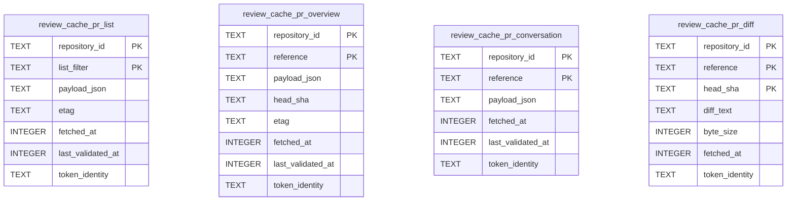

# ✨ feat: Instant PR open — server-side review cache (SQLite + SWR)

> Implementation plan for **P1–P3** of the architecture in [`.plans/20-github-sync-cache.md`](./20-github-sync-cache.md). Scoped to the real target: **1–2 repos**. Grounded in verified code patterns (file:line throughout) and a flow/edge-case analysis.

## Overview

Opening a PR review re-shells out to `gh` every time (browser → WS → server → `gh` subprocess, no caching) and the client `QueryClient` is in-memory only (`apps/web/src/router.ts:11`). Cold start, Electron window recreation, and 5-min `gcTime` eviction all re-pay the subprocess spawn **and** the Schema decode.

This plan adds a **server-side SQLite cache** (`ReviewCacheStore`) behind the read methods in `apps/server/src/review/Layers/ReviewSource.ts`, using **stale-while-revalidate**: serve the cached normalized row instantly, fork a background `gh` refresh, write it back, and (P2) push it to open clients over a new `review.updated` channel. The infrastructure already exists — the server runs a `node:sqlite` subsystem with `SqlClient` in scope for the review layer, `repositoryId` as a ready cache key, and a streaming-RPC push mechanism to reuse.

**P1 alone delivers instant warm-open.** P2 makes the background refresh visible live. P3 adds correctness polish (mutation invalidation, manual refresh, eviction).

## Problem Statement / Motivation

- **Slow open:** every read = a `gh` subprocess (30s timeout; diffs 120s) + `decodeGitHubJson` Schema decode (`GitHubCli.ts:849-875`). Nothing is cached server-side.
- **No persistence:** `new QueryClient()` is bare; cold start / window recreate / navigation re-fetch.
- **Rate-limit risk at any polling cadence** if we naively re-fetch.

At 1–2 repos the rate-limit math is trivial (≈20–40 req/hr, <1% of the 5,000/hr budget — see §Quota), so the design can stay simple: **TTL + in-flight de-dup + SWR**, no ETag machinery in v1.

## Proposed Solution

A keyed read-through cache wrapping the four hot reads (`listPullRequests`, `loadPullRequest`, `loadConversation`, `loadChangeset`):

1. **Read:** look up the cached normalized row by `(repository_id, resource, reference)`. Hit → **return immediately** (zero `gh` on the read path). Miss → fall back to today's `gh` path, write the row, return.
2. **Revalidate (SWR):** past the per-resource fresh window, fork **one** background `gh` refresh (de-duped by an in-flight key), write the fresh row, and emit `review.updated` (P2).
3. **Deliver:** **write-DB-first, push-as-optimization, pull-on-reconnect.** The DB row is the durable commit point; the push is best-effort; the client re-requests on WS reconnect.

### Decisions (resolving the spec-flow open questions)

| # | Decision |
|---|---|
| **Quota lever (OQ-3/OQ-6)** | **TTL + in-flight de-dup + SWR pacing.** Do **not** rely on `gh api` 304s (cli/cli#2941). Add a simple circuit breaker: on `gh` 403/429, widen intervals / pause background refresh. ETag/conditional revalidation via a real HTTP client is **deferred to P4**, optional, only if repo count grows. |
| **TTL per resource (OQ-1)** | Fresh windows: `list` 60s · `overview` 45s · `conversation` 45s · `diff` keyed by `head_sha` (fresh until head moves). Stale-max: 24h for all (past it, still serve stale + background-replace — never block). |
| **Hard-expiry behavior (OQ-2)** | Always **serve stale immediately + revalidate**; only a true cold-miss shows the loading skeleton (already built). Preserves instant-open. |
| **Delivery (Gap 2 / F5 / F6)** | Write-DB-first → push-as-optimization → pull-on-reconnect. A refresh that completes while disconnected is durable in the DB and returned on the next request. |
| **Diff freshness (F8)** | Diff row keyed by `(repository_id, reference, head_sha)`. `head_sha` is authoritative from `getPullRequestHeadSha` (cheap) / overview; never serve a diff for a superseded `head_sha`. |
| **Mutation invalidation (F9)** | `reviewSubmission.submit` + comment mutations clear/refresh `conversation` + `overview` rows for that PR immediately (alongside existing client invalidation at `reviewReactQuery.ts:188-229`). |
| **Eviction (OQ-5)** | Diffs: skip caching any diff > **2 MB**; cap diff rows per repo (LRU by `fetched_at`, e.g. 50 rows). Small rows: keep last-known per key; evict all rows on repo removal. |
| **Auth-scope (OQ-4)** | **Deferred for v1** (1–2 personal repos). Store a `token_identity` column for forward-compat, but reads are not auth-gated yet. Documented risk. |
| **Manual refresh (OQ-7)** | P3: a refresh affordance that bypasses TTL (force-revalidate) and busts the `head_sha` diff key. |
| **Reconnect (OQ-8)** | Enable `refetchOnReconnect` for overview/conversation; each cached payload is served with the DB row, so a reconnect re-request returns the latest written row. |
| **Clock basis (Gap 10)** | TTL compares against `fetched_at` on the **server clock** only. |

## Architecture

### Data model

One table per cacheable resource (each has its own freshness rules), sharing a common envelope. JSON payloads stored as `TEXT *_json` per the repo convention.



Commits + checks ride inside the `overview` payload (one `gh pr view --json ...,commits,statusCheckRollup` today — no extra round-trips). DDL conventions (verified): `CREATE TABLE IF NOT EXISTS`, timestamps as `TEXT`/`INTEGER`, JSON as `TEXT *_json`, indexes `CREATE INDEX IF NOT EXISTS`. Add `(token_identity)` and `(repository_id, last_validated_at)` indexes for the (future) staleness scan.

### Layer wiring (verified)

`SqlClient.SqlClient` is provided app-wide at `apps/server/src/main.ts:251` (`Layer.provideMerge(SqlitePersistence.layerConfig)`), so any layer assembled under it gets `SqlClient` for free. Add `ReviewCacheStoreLive` to the `Layer.mergeAll(...)` in `apps/server/src/review/runtimeLayer.ts:10` — **do not** add `SqlClient` to that inner `Layer.provide` (it would shadow it). Precedent: `OrchestrationLayerLive`'s repos declare `SqlClient` as a requirement satisfied at the same top-level merge.

### SWR read flow

```
client query ──WS──> wsRpc handler ──> ReviewSource.loadX(input)
                                          │
                                          ├─ resolveRepositoryId(cwd)        # ReviewSource.ts:160-180
                                          ├─ cache.get(repoId, resource, ref)
                                          │     hit & fresh  -> return row
                                          │     hit & stale  -> return row + fork refresh
                                          │     miss         -> gh fetch -> cache.upsert -> return
                                          └─ refresh fork (de-duped):
                                                gh fetch -> normalize -> cache.upsert -> emitUpdate(payload)  # P2
```

In-flight de-dup (F7): a `Map<cacheKey, Effect>` (or `Effect` request-cache / `Semaphore`-guarded fiber) so K concurrent opens of the same uncached PR produce **one** `gh` call.

### `review.updated` push channel (P2)

**Key fact:** Synara has no `broadcast`; "push channels" are client re-emissions of streaming RPC subscriptions backed by a server `PubSub` (reference: `serverSettings.ts:57-76` → `wsRpc.ts:784` → `wsTransport.ts:352-359` → `wsNativeApi.ts:285-303` → `__root.tsx:1188-1193`). So the channel = a streaming RPC whose source is a `PubSub.unbounded<ReviewUpdatedPayload>()` the refresh fork publishes to.

### Quota math (1–2 repos)

| Component | 1 repo, ~30 PRs, 90s probe | Primary req/hr |
|---|---|---|
| Warm opens (cache-served) | 0 `gh` on read path | 0 |
| Background revalidate (TTL-paced, de-duped) | a handful of PRs move/hr | ~10–20 |
| Diff refresh (head_sha change only) | ~5/hr | ~5 |
| **Total (1 repo)** | | **~20 req/hr (≈0.4%)** |

2 repos ≈ ~40 req/hr (≈0.8%). TTL + de-dup alone keep this trivially safe; ETags are unnecessary at this scale.

## Implementation Phases

### Phase 1 — `ReviewCacheStore` + read-through (instant open) ⭐ the core

**Create `apps/server/src/persistence/Migrations/039_ReviewCache.ts`** — copy the `038_ExecutionRuntimeTables.ts` shape (default `Effect.gen`, `yield* SqlClient.SqlClient`, one `sql\`...\`` per `CREATE TABLE IF NOT EXISTS` + indexes for the four tables above).

**Register in `apps/server/src/persistence/Migrations.ts`** (3 edits): import `Migration0039`, append `[39, "ReviewCache", Migration0039]` to `migrationEntries`. Nothing else — `Migrator.fromRecord` runs IDs greater than the latest recorded.

**Create `apps/server/src/review/Services/ReviewCacheStore.ts`** — `ServiceMap.Service<ReviewCacheStore, ReviewCacheStoreShape>()("t3/review/Services/ReviewCacheStore")`. Schema structs for each row + a DB-row schema using `Schema.fromJsonString(...)` for `payload_json`. Shape:

```ts
// sketch — Services/ReviewCacheStore.ts
export interface ReviewCacheStoreShape {
  readonly getOverview: (k: OverviewKey) => Effect.Effect<Option<CachedOverview>, ReviewCacheError>;
  readonly putOverview: (row: CachedOverview) => Effect.Effect<void, ReviewCacheError>;
  // get/put for list, conversation, diff (diff key includes head_sha); evictDiff(repoId)
}
```

**Create `apps/server/src/review/Layers/ReviewCacheStore.ts`** — `Layer.effect(ReviewCacheStore, Effect.gen(function*(){ const sql = yield* SqlClient.SqlClient; ... }))` using `SqlSchema.void` (upsert via `INSERT ... ON CONFLICT (pk) DO UPDATE SET col = excluded.col`) and `SqlSchema.findOneOption`, mapping errors with `toPersistenceSqlError("ReviewCacheStore.method:query")` (reuse `persistence/Errors.ts`).

**Wrap the reads in `apps/server/src/review/Layers/ReviewSource.ts`** (`listPullRequests` :182-200, `loadPullRequest` :306-309, `loadConversation` :311-346, `loadChangeset` :299-302) with a shared `readThrough(key, ttl, fetch)` helper: resolve `repositoryId`, `cache.get` → serve hit; on stale fork the de-duped refresh; on miss fetch + `cache.put`. Add `ReviewCacheStore` to `makeReviewSource`'s `yield*` deps.

**Wire `ReviewCacheStoreLive`** into `apps/server/src/review/runtimeLayer.ts:10` `Layer.mergeAll(...)`.

**Tests** (`apps/server/src/review/Layers/ReviewCacheStore.test.ts`) — `it.layer(Layer.mergeAll(ReviewCacheStoreLive.pipe(Layer.provideMerge(SqlitePersistenceMemory)), SqlitePersistenceMemory))`: round-trip upsert/get per resource; JSON survives; diff keyed by head_sha; ReviewSource read-through serves cached row with a `gh`-call spy proving **one** call under K concurrent opens (F7) and **zero** on warm hit (F2).

**Ships:** instant warm-open. Refresh is unconditional `gh` (no ETags). Client sees fresh data on its next fetch (P2 makes it live).

### Phase 2 — `review.updated` live revalidation push

Follow the verified 6-step wiring (model on `server.settingsUpdated`):

1. **Contract** `packages/contracts/src/review.ts`: add `ReviewUpdatedResource` (Literals) + `ReviewUpdatedPayload = { repositoryId, resource, reference, payload }`.
2. **`packages/contracts/src/ws.ts`**: channel `reviewUpdated: "review.updated"`; method `subscribeReviewUpdates: "review.subscribeUpdates"`; `WsPushPayloadByChannel` entry; `WsPushReviewUpdated = makeWsPushSchema(...)`; add to `WsPushChannelSchema` literals + `WsPush` union; `tagRequestBody(...)`. Add the streaming method to `WsRpcGroup` (`rpc.ts`) modeled on `subscribeServerSettings`.
3. **Server** `ReviewSource`: `const updatesPubSub = yield* PubSub.unbounded<ReviewUpdatedPayload>()`; `emitUpdate`/`streamUpdates` (mirror `serverSettings.ts:57-76`); `Effect.tap(emitUpdate)` in the refresh fork. Handler `wsRpc.ts` next to `:784`: `[WS_METHODS.subscribeReviewUpdates]: () => reviewSource.streamUpdates`.
4. **Transport** `wsTransport.ts` `startChannelStream` (+ `stopChannelStream`): translate the stream onto `WS_CHANNELS.reviewUpdated`.
5. **Native API** `wsNativeApi.ts`: listener `Set` + `onReviewUpdated(...)` (mirror `:285-303`).
6. **Route → cache** `__root.tsx` (or the review route): `onReviewUpdated(p => queryClient.setQueryData(reviewQueryKeys[resource](cwd, ref), p.payload))`.

> **Key-shape gotcha (from grounding):** the `changeset` key is `[cwd, sourceKey]` where `sourceKey = "pullRequest:<reference>"` (`reviewReactQuery.ts:28-32`), while `pullRequest`/`conversation`/`remoteThreads` use the raw `reference`. The payload `reference` must match the target key form, or the handler reconstructs `sourceKey`. Prefer `invalidateQueries` for `remoteThreads`; `setQueryData` only where `payload.payload` matches the cached result schema.

### Phase 3 — correctness polish

- **Mutation invalidation (F9):** in `reviewSubmission.submit` + comment mutations, clear/refresh the `(repositoryId, reference)` overview+conversation rows.
- **Manual hard-refresh (OQ-7):** a refresh control that force-revalidates (bypasses TTL, busts diff `head_sha`).
- **Eviction (OQ-5):** diff size cap (skip >2 MB) + per-repo LRU; evict on repo removal.
- **Reconnect (OQ-8):** enable `refetchOnReconnect` for overview/conversation.
- **Circuit breaker:** pause background refresh on `gh` 403/429.

### Phase 4 — (optional) conditional revalidation via real HTTP client

Only if repo count grows. Add `etag`/`last_modified`/`token_identity` handling via Octokit/raw HTTPS with the `gh` token (do **not** use `gh api` 304s). Plus the multi-repo limiter/jitter (deferred from the design doc §4C).

### Phase 5 — (optional) client `persistQueryClient` (IndexedDB)

Replace bare `new QueryClient()` with `PersistQueryClientProvider` + `idb-keyval`; `gcTime ≥ maxAge`, `useIsRestoring`, `buster` = schema/`gh` version. Bridges window-open → first WS response.

## Acceptance Criteria

### Functional
- [ ] **AC1 (F1):** First open of an uncached PR returns within one `gh` round-trip, persists a row, and shows a loading skeleton before data.
- [ ] **AC2 (F2):** Warm open returns the cached payload with **zero `gh` calls on the read path**; background revalidate scheduled exactly once.
- [ ] **AC7 (F7):** K simultaneous opens of one uncached PR → **exactly one** `gh` invocation (verified with a spy); all K receive the same payload.
- [ ] **AC8 (F8):** A changed `head_sha` is never served from the prior diff row; the new sha's diff is fetched. Diff key includes `head_sha`.
- [ ] **AC9 (F9):** A successful review/comment mutation reflects in conversation+overview without waiting for TTL.
- [ ] **AC13 (F13):** Fresh install (no DB file) initializes schema; first open of every resource succeeds as a cold miss with no error.
- [ ] **(P2)** A background-revalidated change pushes to an open PR view and patches the query in place (no manual refetch).

### Non-functional / quality
- [ ] **AC4 (F4):** `gh` failure during background revalidate serves stale + a non-blocking signal; cold-miss failure surfaces the typed message (uses existing `rpcErrorMessage`). 403/429 distinguished from network errors.
- [ ] **AC6 (F6):** Server crash between DB-write and push loses no data — next request returns the written row (write-before-push).
- [ ] **AC10 (F10):** Diff cache enforces the size/count bound + eviction; diffs >2 MB are not cached.
- [ ] **AC-quota:** With 1–2 repos, steady-state stays <2% of the 5,000/hr budget (TTL + de-dup; no ETags).
- [ ] `bun fmt` / `bun lint` / `bun typecheck` pass; new store + read-through covered by tests.

## Test Plan

- **Store unit** (`ReviewCacheStore.test.ts`, `it.layer` + `SqlitePersistenceMemory`): upsert/get round-trip per resource; JSON fidelity; diff `head_sha` keying; eviction bound.
- **Read-through unit** (extend a ReviewSource test with a `GitHubCli` test-double spy): warm-hit = 0 `gh` (AC2); K-concurrent = 1 `gh` (AC7); miss → fetch+persist (AC1); stale → serve + 1 fork.
- **Migration:** a fresh memory DB builds (migration 39 runs) and the four tables exist (AC13).
- **Contract/typecheck (P2):** the exhaustive `WsRpcGroup` + `wsRpc.ts` handler map compile (adding a WS method requires both, or build breaks).
- **Manual/live:** warm open is visibly instant; a comment submitted elsewhere appears via `review.updated` (P2).

## Risks & Mitigations

| Risk | Mitigation |
|---|---|
| `gh api` 304 unreliability (cli/cli#2941) silently defeats a rate-limit goal | v1 does **not** use 304s; quota lever is TTL + de-dup + SWR (documented). Conditional path is P4 via a real HTTP client. |
| Stale-render surprises the user | Serve-stale + background-replace; P3 adds a "refreshing/last-updated" affordance + manual refresh. |
| Cache-write race (slow stale fetch clobbers newer mutation) | Last-writer-wins keyed by `fetched_at`/`head_sha`; mutation invalidation runs in the same server layer. |
| Diff bloat (large/binary diffs) | Skip caching >2 MB; per-repo LRU cap. |
| `node:sqlite` (not better-sqlite3) — no streaming reads, Node ≥22.16 | Point reads only (no `executeStream`); the runtime already enforces the Node version. |
| Auth-scope ignored for private repos | Acceptable at 1–2 personal repos; `token_identity` column stored for forward-compat; revisit on multi-account. |

## Open Questions (remaining for the human)

1. **TTL values** — are 60/45/45s fresh windows + 24h stale-max acceptable, or do you want fresher overview/conversation?
2. **P2 in v1 or fast-follow?** P1 gives instant-open; live-fresh-without-refetch needs P2. Ship together or sequence?
3. **Manual refresh placement** — a button in the PR header/tab strip, or rely on `refetchOnReconnect` + TTL?
4. **Diff cap** — 2 MB skip + 50-row LRU per repo reasonable?

## References

### Internal (verified file:line)
- Design doc: [`.plans/20-github-sync-cache.md`](./20-github-sync-cache.md)
- Wrap target (reads): `apps/server/src/review/Layers/ReviewSource.ts:182-346`; `repositoryId` key `:160-180`
- `gh` exec + decode: `apps/server/src/git/Layers/GitHubCli.ts:877-887`, `:849-875`
- Store pattern to copy: `apps/server/src/persistence/{Services,Layers}/ProjectionProjects.ts`; test `persistence/Layers/ProjectionRepositories.test.ts`
- Migration shape + registration: `apps/server/src/persistence/Migrations/038_ExecutionRuntimeTables.ts`, `persistence/Migrations.ts`
- SqlClient provided: `apps/server/src/main.ts:251`; review layer wiring `apps/server/src/review/runtimeLayer.ts:10`
- WS push reference (`server.settingsUpdated`): `apps/server/src/serverSettings.ts:57-76` → `wsRpc.ts:784` → `apps/web/src/wsTransport.ts:352-359` → `wsNativeApi.ts:285-303` → `__root.tsx:1188-1193`
- Client cache keys: `apps/web/src/lib/reviewReactQuery.ts:28-52`; bare `new QueryClient()` `apps/web/src/router.ts:11`

### External (verified, 2025–2026)
- GitHub REST rate-limits & best-practices (conditional 304s are free); GraphQL points; webhook events
- `cli/cli#2941` — `gh api` does not reliably honor conditional requests
- TanStack DB / `persistQueryClient` (deferred options)

### AI-era notes
- Plan grounded by two parallel research workflows (rate-limit/persistence/architecture; then store/WS/spec-flow patterns). Code sketches are illustrative — verify each `SqlSchema`/`PubSub` call against the cited reference file when implementing. The exhaustive `WsRpcGroup`/`wsRpc.ts` handler map means P2 contract edits must be complete or the build fails (a useful compile-time guardrail).
