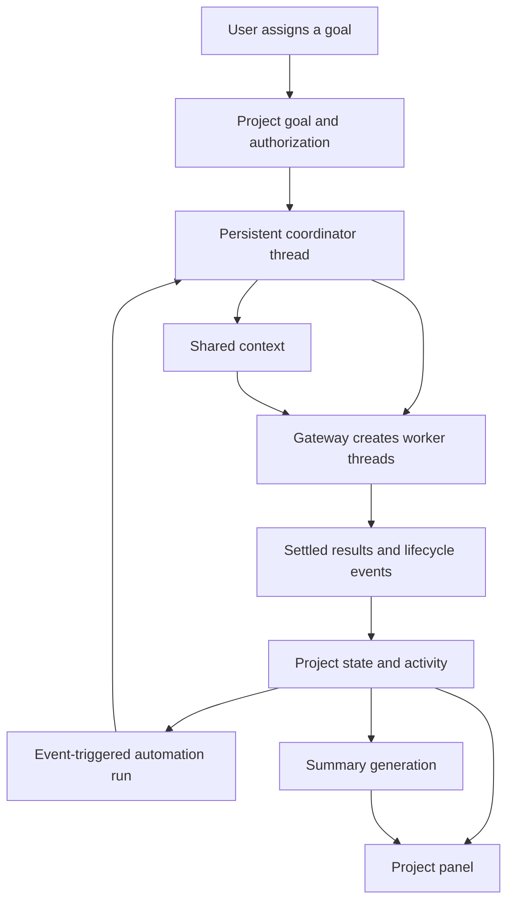

PLEASE IMPLEMENT THIS PLAN:
# Synara Project Coordinator

**Summary**

Add a **Project icon beside Environment** that opens a persistent workspace for the current Synara project. It combines a named coordinator, shared context, task tracking, and summaries across threads.

The design follows your choices:

- Enhance existing Synara projects.
- Give each project one persistent coordinator thread in the main chat.
- Keep shared context in private Synara storage.
- Allow autonomous progress within an assigned goal.
- Show project information in the right panel.

## 1. Research findings and implications

Cursor launched Projects on September 10, 2026. Its documented model combines a coordinator that delegates implementation, shared context files, and subscriptions to events or schedules. It also supplies cloud execution that continues independently of the user’s laptop. [Cursor announcement](https://cursor.com/blog/projects)

Your screenshots show the complementary interface: a Focus summary, linked work items, completion indicators, archived work, and browsable Markdown context. They establish the visible experience; they do not establish Cursor’s internal storage or coordination implementation.

Synara already has much of the infrastructure:

| Capability | Current Synara implementation | Required addition |
|---|---|---|
| Projects and threads | Persistent project IDs, workspace roots, thread relationships | Coordinator identity and project configuration |
| Right-panel interface | Environment panel with docked and floating layouts | Shared panel host with a Project surface |
| Agent delegation | Gateway thread creation, messages, provider discovery, durable operations | Goal ownership and project-scoped authorization |
| Background execution | Automation runs, leases, recovery, queued turns | Project-event triggers |
| Summaries | Browser-cached thread recaps | Durable project summaries with evidence |
| Task tracking | Kanban columns derived from thread runtime state | Explicit task outcomes, dependencies, and acceptance |
| Project instructions | Browser local storage | Shared server-backed instructions for enabled projects |

These conclusions come from the checkout at `779cd649e060c17a57ede329b51fbe67e6b02663`, including [ChatView](<file:///Users/dilipreddy/Open Source Contributions/synara/apps/web/src/components/ChatView.tsx>), [Gateway creation](<file:///Users/dilipreddy/Open Source Contributions/synara/apps/server/src/agentGateway/creationCoordinator.ts>), [automation service](<file:///Users/dilipreddy/Open Source Contributions/synara/apps/server/src/automation/Services/AutomationService.ts>), and [Kanban derivation](<file:///Users/dilipreddy/Open Source Contributions/synara/apps/web/src/components/kanban/kanban.logic.ts>).

**Architectural decision:** build project coordination on Synara’s existing execution infrastructure. Extend automation runs for event-driven continuations; keep goals, tasks, documents, and summaries in a dedicated project domain.

The inspected checkout supports `heartbeat` and `standalone` automations. Use the existing targeted `heartbeat` execution path for the coordinator; do not assume newer capabilities exposed by the running host already exist in this source tree.

## 2. Product experience

### Entry and layout

Place the controls in this order:

**Environment · Project · existing right-dock control**

Environment and Project share one auxiliary panel slot. Selecting one replaces the other; selecting the active icon closes it. The browser/editor/diff dock keeps its current behavior.

Extract a shared `ChatAuxiliaryPanel` from the Environment layout:

- Wide single chat: reserve space beside the transcript.
- Split view, terminal, or open right dock: use the existing floating treatment.
- Mobile: use an accessible sheet.
- Preserve the selected surface while navigating between threads in the same project.
- Resolve content from the focused thread’s project; never display another project’s cached content.
- Hide Project for system-managed Chats and Studio containers.

Use the shared disclosure motion, including reduced-motion behavior. The extraction should also replace Environment’s existing bespoke toggle timing with the required shared implementation.

### First use

Opening Project does not launch a model.

An unconfigured project offers **Set up coordinator**, with:

- Coordinator name; default: `<Project name> Coordinator`.
- Coordinator provider/model, prefilled from the project default or current thread.
- Worker routing and execution limits.
- Shared-context capture enabled for persistent project threads.

Saving creates the configuration and coordinator thread. Assigned work starts only when the user starts a goal.

### Four panel views

| View | Contents |
|---|---|
| **Overview** | Coordinator status, active goal, up to five Focus items, blockers, recent outcomes, last summary update |
| **Work** | Tasks, dependencies, assigned threads, review state, evidence, archived items |
| **Context** | Browsable shared documents, Markdown preview/source editing, revision history |
| **Activity** | Chronological decisions, task transitions, worker outcomes, context updates, and errors |

The panel header provides **Open coordinator**, **Pause**, and a settings menu. “Open coordinator” navigates to the persistent main-chat thread while preserving the current worker’s draft.

Each Focus item links to its task, source message, or artifact. Pending approvals remain visible through the existing approval interface.

### Coordinator conversation

The coordinator plans, delegates, reviews outcomes, and maintains project context. Implementation happens in worker threads.

The conversation initially supports discussion without execution. **Start goal** submits the user’s objective and activates bounded coordination. Subsequent direction continues that goal; changing its authorized scope is a user action.

V1 supports one active goal per project, with multiple dependent tasks and workers. Completed goals remain searchable.

## 3. Shared context and persistence

Use Synara’s configured `stateDir`, with the following private materialized workspace:

```text
project-context/<projectId>/
  overview.md
  instructions.md
  notes.md
  decisions.md
  archived.md
  docs/
  inbox/<threadId>/<turnId>.md
  artifacts/index.md
  internal/manifest.json
```

Ownership is explicit:

- `instructions.md`: user-owned instructions.
- `notes.md`: user-editable notes.
- `decisions.md` and `docs/`: coordinator-curated knowledge with sources.
- `inbox/`: worker findings awaiting consolidation.
- `overview.md` and `archived.md`: generated views of structured state.
- `artifacts/index.md`: references to existing managed artifacts.

**SQLite is authoritative.** Documents have immutable revisions, authors, timestamps, content hashes, and source references. Markdown files are recoverable materialized copies written atomically using existing server utilities.

Edits through Synara or agent tools require an expected revision. Conflicting edits return a conflict instead of overwriting newer content. Unexpected external file changes are preserved and offered for explicit import; the materializer must not silently overwrite them.

Additional rules:

- Normalize relative document paths and reject traversal and symlink escapes.
- Limit individual text documents to 256 KiB.
- Reuse managed attachments instead of duplicating artifact binaries.
- Export selected documents to the repository only through an explicit export action.
- Keep user-wide preferences outside this feature’s initial scope.

### Capture and context delivery

Index all persistent threads belonging to an enabled project, including archived threads. Exclude temporary and deleted threads. Provide a per-thread exclusion control.

At initial setup:

- Index historical thread metadata immediately.
- Summarize the 20 most recently updated threads.
- Mark remaining history as not yet summarized and support incremental backfill.
- Never present partial historical coverage as complete project knowledge.

Before coordinator and worker turns, inject a bounded context packet containing the goal, instructions, relevant decisions, task details, and document references. Limit injected project context to 32,000 characters; retrieve additional documents through tools.

Workers report findings into their own inbox entries. They cannot rewrite user instructions or mark another worker’s task accepted.

For enabled projects, import existing browser-stored project instructions once without overwriting server content. Preserve differing copies for reconciliation. Environment’s instructions editor then uses the same server document. Existing thread recaps and thread notes retain their current behavior.

## 4. Domain model and public interfaces

Add schema-only definitions in `packages/contracts/src/projectAgent.ts`. Put runtime helpers in explicit `packages/shared` subpaths and server behavior under `apps/server/src/projectAgent/`.

| Type | Required information |
|---|---|
| `ProjectAgentConfig` | Project ID, coordinator thread/name, model selections, limits, enabled state, revision |
| `ProjectGoal` | Objective, user authorization, scope version, acceptance criteria, limits, lifecycle |
| `ProjectTask` | Goal, title, dependencies, acceptance criteria, status, archive timestamp |
| `ProjectTaskAttempt` | Task, worker thread, Gateway operation, attempt number, runtime outcome |
| `ProjectEvidence` | Source IDs, evidence kind, author, observed/reported/user-confirmed classification |
| `ProjectDocumentRevision` | Logical path, content, revision, hash, author, sources |
| `ProjectActivity` | Ordered event, actor, related goal/task/thread, source reference |
| `ProjectDigest` | Focus items, summary, source coverage, generation state and timestamp |

Task states:

`planned → ready → running → review → done`

`blocked` and `cancelled` are explicit alternatives. Archiving is independent of completion.

A finished provider turn updates an **attempt**. It cannot by itself mark a task done. Acceptance requires a coordinator or user decision against the task’s criteria and recorded evidence. Dependencies become ready only after their prerequisites are accepted.

Add a `NativeApi.projectAgent` namespace:

- `getOverview`, `configure`
- `startGoal`, `updateGoal`, `pauseGoal`, `resumeGoal`, `stopGoal`
- `listTasks`, `updateTask`
- `listActivity`
- `listDocuments`, `readDocument`, `writeDocument`, `exportDocuments`
- `refreshDigest`
- `subscribe`

Mutations carry stable request IDs; mutable records use revision checks. List methods use cursors with a maximum page size of 100.

Subscriptions use the existing snapshot/replay pattern from [wsSnapshotLiveStream](<file:///Users/dilipreddy/Open Source Contributions/synara/apps/server/src/wsSnapshotLiveStream.ts>). Keep document bodies and historical transcripts out of shell snapshots.

Expose corresponding project read, task, document, and result-reporting MCP tools. Derive project identity and permissions from the calling thread’s server-side association.

## 5. Coordination and recovery



### Reuse automation execution

Add an internal project-event schedule/trigger to the automation contracts. Project-managed definitions target the coordinator thread through the existing heartbeat path and have no calendar `nextRunAt`.

Extend the automation service with event enqueueing that reuses:

- Durable run records and permission snapshots.
- Existing lease and recovery handling.
- Stable turn/message command IDs.
- Existing busy-thread checks and queued dispatch.
- Existing interruption and run reconciliation.

Project-managed automation entries appear as **Managed by Project** and link to Project settings. Their ownership fields cannot be changed through ordinary automation editing.

### Wake behavior

Only events from task-associated attempts can automatically wake the coordinator. Other project threads update the activity feed and summaries without granting execution authority.

Eligible signals include settled results, actionable blockers, and relevant approval or session-state changes. Streaming text, tool chatter, and the coordinator’s own messages do not trigger wakes.

Use a durable event inbox and processing cursor:

1. Record relevant events idempotently.
2. Coalesce pending events while the coordinator is busy.
3. At dispatch, freeze the event range and construct the continuation from current durable state.
4. Assign later events to a subsequent continuation.
5. Reconcile existing runs and receipts after restart before dispatching anything.

User messages take priority over undispatched automatic continuations. Never interrupt a manual turn to deliver background bookkeeping.

### Defaults

| Limit | Default |
|---|---:|
| Concurrent workers per project | 2 |
| New workers per coordinator turn | 4 |
| Worker creations per goal | 12 |
| Automatic coordinator continuations per goal | 20 |
| Repair rounds per task | 2 |

Existing global capacity and Gateway limits also apply. Exhausted limits pause the goal with a clear continuation action.

Writing workers use managed worktrees pinned to an explicit base revision. Reuse existing worker threads for follow-up work. Preserve exact request IDs for operation retries; failed creation does not silently create replacement threads.

**Pause** prevents new dispatches while current tasks settle. **Stop** cancels pending continuations and interrupts the coordinator and managed workers. Unrelated project threads are unaffected.

Provider failures surface their actual reason. Use only explicitly configured fallback targets; never silently change providers or enable another billing route.

### Scope enforcement

Retain existing runtime privilege and worktree-isolation checks. Add project/goal checks to creation, messaging, steering, interruption, and other managed-thread mutations.

The coordinator may observe project threads, but it may drive only threads associated with its active authorized goal. Workers cannot expand goal scope or create further workers by default.

Goal authorization can originate only from a user action. Worker reports, summaries, and imported documents are context, not authorization.

These checks govern Synara-mediated operations. Native provider tools remain subject to the provider’s existing runtime permissions; the private context directory is not a process sandbox.

## 6. Summaries that remain accurate

Use deterministic events for runtime state and a model for concise explanatory text.

Add `generateProjectDigest` to the existing TextGeneration abstraction, with a shared prompt and validated result schema. Use Synara’s configured text-generation provider rather than assuming the coordinator’s provider supports that abstraction.

Generation rules:

- Run server-side after settled changes, even when the panel is closed.
- Debounce for 60 seconds; allow one generation in flight per project.
- Process bounded event batches and previous digest state.
- Require source references for generated Focus items.
- Preserve manually pinned Focus items.
- Track the exact covered event sequence.
- If new events arrive during generation, retain accurate coverage and schedule the remaining delta.
- On failure, retain the last good digest and show its age and pending updates.

The summary model cannot alter task acceptance, permissions, or execution limits. Task completion comes from structured state.

## 7. Implementation sequence

Deliver as six reviewable increments:

1. **Contracts, persistence, and authorization.** Add project-domain tables, revisions, receipts, ownership checks, and migration coverage.
2. **Context workspace.** Implement documents, atomic materialization, inbox reporting, instruction import, and provider context injection.
3. **Project interface.** Extract the shared auxiliary-panel host; add the Project icon, setup flow, four views, and coordinator navigation.
4. **Observation and summaries.** Add durable event ingestion, historical indexing, source-linked activity, and digest generation.
5. **Bounded coordination.** Extend automation triggers, connect goal dispatch and worker attempts, and implement pause/stop/recovery.
6. **Integration and rollout.** Complete failure testing, performance checks, accessibility, and an opt-in local beta.

Keep the feature disabled until configured per project. Shipping an earlier increment must not activate autonomous work.

V1 excludes cross-repository initiatives, cloud machines, cross-host document synchronization, Slack/GitHub subscriptions, and recurring maintenance goals. Existing execution continues only while the Synara server and required providers are available.

## 8. Verification and acceptance

Required scenarios:

- Multiple threads show the same project state and coordinator.
- Switching projects or split-pane focus never leaks cached project content.
- Coordinator navigation preserves worker drafts.
- Concurrent document edits cannot lose updates.
- A worker’s completed turn remains under review until accepted.
- Dependency cycles and invalid cross-project references are rejected.
- Duplicate events and restarts cannot create duplicate workers or continuations.
- Events arriving during a coordinator turn appear in the next continuation.
- Unrelated threads and self-generated events do not wake the coordinator.
- Paused, stopped, deleted, or scope-revised goals reject stale dispatches.
- Cross-project control and privilege escalation remain blocked.
- Summary failures, invalid source references, and partial backfill remain visibly distinguishable from verified state.
- Project deletion disables associated coordination and follows existing deletion semantics; disabling the feature preserves its history.

Performance and interface coverage:

- Exercise 1,000 threads and 10,000 activity records with paginated reads.
- Confirm Project updates do not rerender or auto-scroll an unchanged transcript.
- Confirm token streaming does not cause project digest requests.
- Test narrow windows, mobile sheets, split view, keyboard navigation, focus restoration, and reduced motion.
- Track event backlog age, rejected duplicate dispatches, digest failures, and context-materialization conflicts.

Run focused Vitest suites using `bun run test`, never `bun test`. Validate the interface in an isolated Synara instance with separate state and ports.

The repository requires `bun fmt`, `bun lint`, and `bun typecheck` before implementation is considered complete, but prohibits running them without an explicit request. Reserve one final bundled pass once authorized.

**Research status:** official Cursor material reviewed, repository integration points inspected, and a bounded Fable architecture review completed and checked against source. No source files were changed and no implementation tests were run.
