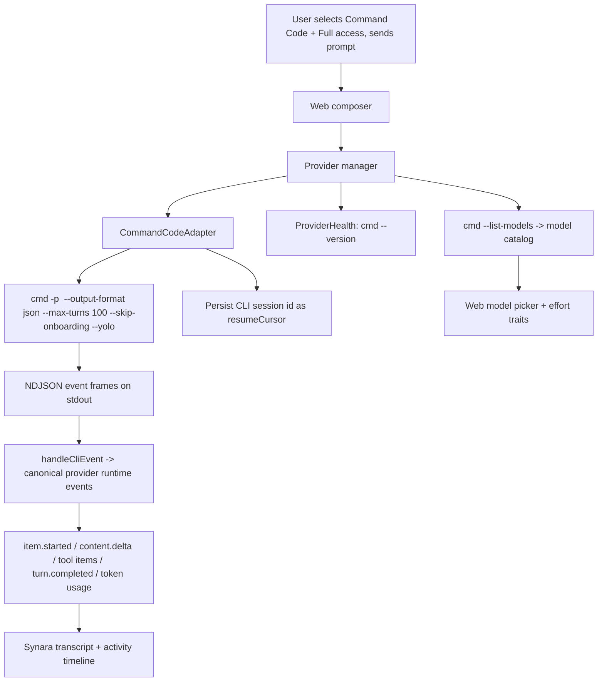

# Command Code CLI Provider Support — Full Documentation

## Summary

Added **Command Code** (`commandcode`, binary `cmd`) as a first-class Synara provider. Synara previously detected only a handful of CLIs (Codex, Claude, Cursor, Antigravity, Grok, Droid, Kilo, OpenCode, Pi); this work adds full Command Code CLI support end to end:

- **Server**: a brand-new provider adapter (`CommandCodeAdapter`) that launches the CLI in print mode (`cmd -p`), streams the NDJSON event frames into Synara's canonical provider-runtime events, persists the CLI session id for resume, discovers the live model catalog via `cmd --list-models`, and reports health via `cmd --version`.
- **Contracts/shared**: the `commandcode` provider kind threaded through every schema, model-selection type, settings schema, provider metadata descriptor, and terminal/activity presentation model.
- **Web**: provider selection, model picker with reasoning-effort (low/medium/high) traits, runtime model discovery, settings (binary path + custom models), favorites, icons, plugin/skill capability wiring, and composer send support.

The work is uncommitted on `main` and touches **55 files (+582 / −26 lines)**.

## Why Command Code works differently

Command Code is a CLI-first coding agent. In print mode it accepts the prompt as a **command-line argument**:

```
cmd -p "<prompt>" --output-format json --max-turns 100 --skip-onboarding --yolo \
  [--session <id>] [--model <slug>] [--effort low|medium|high]
```

Two consequences shaped the implementation:

1. **No interactive approval pause.** Print mode cannot pause for interactive approvals, so the adapter **hard-requires `full-access` runtime mode** (the `--yolo` flag) and rejects `approval-required` with a clear validation error: _"Command Code CLI print mode cannot pause for interactive approvals. Select Full access to use this provider."_ `respondToRequest` / `respondToUserInput` return an unsupported error.
2. **NDJSON streaming.** With `--output-format json`, the CLI emits newline-delimited JSON frames: `{"type":"event","event":{...}}` lifecycle events interleaved with `{"type":"result",...}` / `{"type":"error",...}` final frames. The adapter parses both with one line-splitter.

## Files Affected

### Server — new adapter + wiring

- `apps/server/src/provider/Services/CommandCodeAdapter.ts` — **new** Effect service tag: `CommandCodeAdapterShape extends ProviderAdapterShape<ProviderAdapterError>` with `provider: "commandcode"`.
- `apps/server/src/provider/Layers/CommandCodeAdapter.ts` — **new** full adapter implementation (session lifecycle, NDJSON streaming, event mapping, usage normalization, model discovery, helper process runner, harness policy).
- `apps/server/src/provider/Layers/ProviderAdapterRegistry.ts` — imports `CommandCodeAdapter` and provides it to the registry so `ProviderAdapterRegistry` can resolve it.
- `apps/server/src/provider/Layers/ProviderHealth.ts` — `checkCommandCodeProviderStatus(binaryPath)` via `cmd --version` probe; added to the parallel health-refresh list.
- `apps/server/src/provider/providerStatusCache.ts` — `"commandcode"` added to the status cache ids.
- `apps/server/src/provider/runtimeLayer.ts` — `makeCommandCodeAdapterLive()` layer built and provided into the provider layer composition.
- `apps/server/src/provider/skillsCatalog.ts` — Command Code skill origin: home root `~/.cmd/skills`, project root `.cmd`, preference order `["commandcode", "agents"]`.
- `apps/server/src/agentGateway/targetResolver.ts` — provider target option config: `primaryOptionKey: "reasoningEffort"`, option `reasoningEffort` (string, model-discovery).
- `apps/server/src/agentGateway/toolInput.ts` — `"commandcode"` added to `PROVIDER_KINDS`.
- `apps/server/src/persistence/modelSelectionCompatibility.ts` — infer `commandcode` from "command code"/"commandcode" labels and accept it in legacy provider mapping.
- `apps/server/src/profileStats.ts` — `commandcode` in the provider kinds set.
- `apps/server/src/providerChildEnvironment.ts` — child environment handles the `commandcode` provider.

### Contracts (schema-only package)

- `packages/contracts/src/model.ts` — `CommandCodeModelOptions` (`reasoningEffort`), `ProviderModelOptions.commandcode`, `MODEL_OPTIONS_BY_PROVIDER.commandcode = []` (CLI supplies the live catalog), `DEFAULT_MODEL_BY_PROVIDER.commandcode = "deepseek/deepseek-v4-flash"`, `MODEL_SLUG_ALIASES_BY_PROVIDER.commandcode = {}`, `PROVIDER_DISPLAY_NAMES.commandcode = "Command Code"`.
- `packages/contracts/src/orchestration.ts` — `commandcode` in `ProviderKind` literals and provider session/turn input schemas.
- `packages/contracts/src/providerRuntime.ts` — provider literal added.
- `packages/contracts/src/providerDiscovery.ts` — `commandcode` in discovery kind literals.
- `packages/contracts/src/settings.ts` — `CommandCodeServerProviderSettings` (`binaryPath` defaulting to `"cmd"`), `ServerSettings.providers.commandcode`, patch schema.
- `packages/contracts/src/agentMentions.ts` — `AGENT_MENTION_ALIASES_BY_PROVIDER.commandcode = {}`, autocomplete aliases `[]`.
- `packages/contracts/src/terminal.ts` — `commandcode` in terminal activity agent literals.

### Shared

- `packages/shared/src/providerMetadata.ts` — `PROVIDER_DESCRIPTORS` entry: display name, `available: true`, `supportsNativeTurnSteering: false`, usage `{ signInCommand: "cmd login", learnMoreHref: "https://commandcode.ai/docs" }`.
- `packages/shared/src/model.ts` — empty built-in slug set for `commandcode`, plus `normalizeCommandCodeModelOptions` (validates `reasoningEffort` against model capabilities and drops it when equal to the default).
- `packages/shared/src/serverSettings.ts` — `providerStartOptionsFromServerSettings` maps `commandcode.binaryPath` into provider start options.
- `packages/shared/src/terminalThreads.ts` — `TerminalCliKind` / `TerminalIconKey` extended with `commandcode` and presentation metadata.

### Web

- `apps/web/src/appSettings.ts` — `commandCodeBinaryPath` + `customCommandCodeModels` settings, `PersistedProviderKind` literal, provider custom-model config, normalization, server↔app settings mapping, provider start options, `getCustomBinaryPathForProvider`.
- `apps/web/src/confirmedCustomBinaryPathStore.ts` — `commandcode` added to binary-path kinds.
- `apps/web/src/components/Icons.tsx` — new `CommandCodeIcon` SVG.
- `apps/web/src/components/ProviderIcon.tsx` — `commandcode → CommandCodeIcon`.
- `apps/web/src/components/chat/composerProviderRegistry.tsx` — registry entry with reasoning-effort handling in `getProviderStateFromCapabilities`, traits menu/picker.
- `apps/web/src/components/chat/runtimeModelCapabilities.ts` — `commandcode` excluded from the static-capability fallback so runtime (`cmd --list-models`) efforts win.
- `apps/web/src/components/chat/ComposerModelEffortPicker.browser.tsx` — effort picker support.
- `apps/web/src/components/chat/ProviderModelOptionGroupList.tsx` — `FavoriteModelProvider` includes `commandcode`.
- `apps/web/src/components/chat/ProviderModelPicker.tsx` / `.browser.tsx` — provider appears in pickers.
- `apps/web/src/components/chat/TraitsPicker.browser.tsx` — harness fixtures include `commandcode`.
- `apps/web/src/components/PluginLibrary.tsx` — capabilities query (plugins `false`, skills `true`).
- `apps/web/src/components/settings/ProvidersSettingsPanel.tsx` — install card: docs links, "Command Code binary path" text field ("Leave blank to use `cmd` from your PATH.").
- `apps/web/src/components/settings/ProfileSettingsPanel.tsx` — provider in profile panel.
- `apps/web/src/components/settings/skillsSettingsModel.ts` — provider skill settings support.
- `apps/web/src/hooks/useProviderModelCatalog.ts` — `cmd --list-models` dynamic models query, discovery-pending state, option merging.
- `apps/web/src/lib/providerModelPrefetch.ts` — prefetch query options for `commandcode`.
- `apps/web/src/lib/providerModelOptions.ts` — `formatProviderModelOptionName` shortens `provider/model` slugs for Command Code.
- `apps/web/src/lib/composerSend.ts` — `resolvePromptEffortFromModelSelection` returns `reasoningEffort` for `commandcode`.
- `apps/web/src/lib/modelFavorites.ts` — `synara:commandcode-favourite-models:v1` storage key.
- `apps/web/src/composerDraftModels.ts` — `COMPOSER_PROVIDER_KINDS`, `makeModelSelection`, `normalizeProviderModelOptions`, `normalizeModelSelection` support.
- `apps/web/src/components/ChatView.tsx` — provider dispatch/send path and composer wiring.
- `apps/web/src/storeNormalization.ts`, `apps/web/src/session-logic.ts`, `apps/web/src/wsNativeApi.ts` — legacy normalization / snapshots.

### Tests

- `apps/server/src/provider/Layers/ProviderAdapterRegistry.test.ts` — fake `CommandCodeAdapter` registered; registry resolves 10 adapters.
- `apps/server/src/provider/Layers/ProviderHealth.test.ts` — status count 9 → 10; disabled-settings fixtures include `commandcode`.
- `apps/server/src/provider/providerStatusCache.test.ts` — cache id coverage.
- `apps/web/src/appSettings.test.ts`, `composerDraftStore.models.test.ts`, `lib/providerModelPrefetch.test.ts`, `providerUpdates.test.ts`, `session-logic.test.ts`, `wsNativeApi.test.ts` — settings, drafts, prefetch, updates, dispatch.
- `packages/shared/src/serverSettings.test.ts`, `packages/contracts/src/terminal.test.ts` — shared settings mapping and terminal activity.

## Logic Explanation

### Server adapter

`CommandCodeAdapter` (Layers) follows the same architecture as the other provider adapters:

- **Session lifecycle** (`startSession` → `sendTurn` → `interruptTurn` → `stopSession`). `startSession` enforces `full-access`, resolves the binary path (settings `binaryPath` or `"cmd"`), and honors a resume cursor (the CLI session id) from the persisted conversation.
- **Turn execution** (`sendTurn`): builds the harness policy + prompt (`buildCommandCodeTurnPrompt`), appends file attachments as a prompt block, validates the Windows prompt length (print-mode prompts become command-line arguments; hard limit `WINDOWS_PROMPT_MAX_CHARS = 24_000`), then spawns `cmd` with print-mode args, `--session <id>` when resuming, `--model` / `--effort` from the model selection. A strict `ownsTurn()` guard ensures only the current process/turn can emit events after interrupts or restarts.
- **NDJSON streaming**: stdout is read line-by-line. `{"type":"event","event":{...}}` frames are dispatched to `handleCliEvent`; trailing `result`/`error` frames are drained on process close. Supported lifecycle events:
  - `thinking_delta` / `thinking_end` → reasoning item `content.delta` / `item.completed`
  - `text_delta` / `message_end` → assistant item streaming
  - `tool_queued` / `tool_running` / `tool_completed` / `tool_error` → tool items typed by name heuristics into `command_execution`, `file_change`, or `dynamic_tool_call`
  - `turn_end` → token usage snapshot (`normalizeCommandCodeUsage` from input/output/cache-read/cache-write tokens)
  - `run_end` → final text fallback, session id capture, item completion
- **Session id learning**: the CLI's session id (from event frames, `result.sessionId`, or `nextState.sessionId`) is stored as `resumeCursor` so Synara can resume the same conversation after restarts via `--session`. `rollbackThread` clears the cursor (Command Code has no rollback cursor; `ProviderService` rebuilds local context).
- **Terminal turn settling**: `settleActiveTurn` is idempotent, so process-close, interrupt, and stop can all settle exactly one `turn.completed` (`completed` / `interrupted` / `failed`). Interrupt tears down the whole process tree.
- **Model discovery** (`listModels`): runs `cmd --list-models` through a bounded helper runner (15 s timeout, SIGKILL, output capped at 128 KiB) and parses the grouped table with `parseCommandCodeModelLines` — each line is `slug + description`; capitalized section headers ("Open Source", "Anthropic", …) are skipped because model slugs are lowercase ids (possibly `provider/model`). Each model advertises `supportedReasoningEfforts: low/medium/high`.
- **Capabilities**: `sessionModelSwitch: "restart-session"`, `conversationRollback: "restart-session"`, `supportsRuntimeModelList: true`, `supportsLiveTurnDiffPatch: false`; composer capabilities: skills mentions + discovery `true`, plugin mentions/discovery `false`, runtime model list `true`, thread compaction/import `false`.

### Health check

`checkCommandCodeProviderStatus(binaryPath)` probes `cmd --version` with a bounded timeout:

- binary missing or probe failure → `error`, `available: false` ("Command Code CLI (`cmd`) is not installed or is not on PATH.")
- probe timeout → `warning`, `available: true`
- success → `available: true`; auth status is `unknown` because the version probe cannot introspect login state — the settings UI instead points the user to `cmd login` (via provider metadata usage).

### Web integration

Command Code behaves like the other CLI providers in the UI:

- It appears in provider pickers, the model picker (with a reasoning-effort traits picker for `low` / `medium` / `high`), settings (binary path + custom model slugs), the plugin/skill library (skills supported, plugins not), profile stats, and thread handoff targets.
- The model catalog is **runtime-discovered**: `useProviderModelCatalog` issues `providerModelsQueryOptions({ provider: "commandcode" })` against `cmd --list-models` (with prefetch support in `providerModelPrefetch.ts`), merges discovered models with custom models, and marks discovery pending until a `commandcode.cli` source resolves with models.
- Favorites are stored under `synara:commandcode-favourite-models:v1`.

## Flow Diagram



## Verification & How to Use

1. Ensure the CLI is installed and on PATH: `cmd --version` and `cmd login`.
2. In Synara settings → Providers, Command Code should appear. Leave the binary path blank to use `cmd` from PATH, or set a custom path.
3. In a thread, select **Command Code** in the provider/model picker. The model list is fetched live from `cmd --list-models`; pick a model and optionally an effort (low/medium/high).
4. **Full access is required**: the thread runtime mode must be `full-access`; `approval-required` sends are rejected with a clear error toast.
5. Send a message. The transcript shows reasoning, assistant text, tool activity, and final token usage. Interrupting stops the CLI process tree. Restarting Synara resumes the same CLI session when possible.

## Known Limitations

- Print mode cannot pause for approvals → **full-access only** (this is the design constraint of the CLI, enforced explicitly rather than silently failing).
- Model-effort switching restarts the session (no in-session config switch).
- `rollbackThread` cannot roll back the CLI conversation; Synara rebuilds local context and starts fresh.
- Windows prompts are capped at 24,000 characters because the prompt is passed as a command-line argument.

## Debugging Session: "Send button + Enter not working" when Command Code is selected

**Symptom:** With Command Code selected, typing a message and pressing the send button or Enter did nothing (no dispatch, no error in the UI).

**Investigation (how):**

1. Traced the composer submit path in `apps/web/src/components/ChatView.tsx`: `onSubmit` → `onSend` → `resolveProviderSendAvailabilityWithRefresh` (`apps/web/src/lib/providerAvailability.ts`). Sends are gated on the provider's server-reported status — if the provider is unavailable, the send silently blocks (an error toast is surfaced instead).
2. Also confirmed the composer editor is disabled while `isConnecting` / `phase === "disconnected"`, which would freeze the entire composer if the backend is unreachable.
3. Inspected the Command Code adapter (`CommandCodeAdapter.ts`) and health check; found the full-access runtime-mode enforcement and confirmed the CLI itself works (`cmd --version`, `cmd --list-models` succeed).
4. Checked the running `apps/server/dist` build — it includes the commandcode changes (33 matches), so a stale build was not the cause.
5. **Root cause found at runtime:** the dev backend had died — the dev harness (vite + tsdown watch + `dev-electron.mjs`) was still alive, but the Electron GUI process had exited and the runner only auto-restarts on _abnormal_ exits, so it sat idle with no window and no live server. With the server down, provider statuses were stale/unavailable, so the send gating blocked every message regardless of provider.

**Fix:** Killed the stale harness and relaunched the full dev stack in one command:

```
bun run dev:desktop   # logs -> /tmp/synara-dev-harness.log
```

Verified all layers came back healthy:

- UI: vite dev server on `http://localhost:5733` → HTTP 200
- Electron GUI: `Synara (Dev)` app running (main + GPU + renderer processes)
- Backend: server running in desktop mode on port 56302, migrations OK, orchestration engine started, using the real home dir (`~/.synara/dev` with `state.sqlite`), so projects/threads/settings remained intact
- Server `dist` includes the commandcode changes (built after the source edits)

**Lesson:** when send/Enter appear dead, check the live backend first — the composer gates every dispatch on provider availability from the server, so a dead backend freezes sends with only a toast (or nothing) to show for it.
