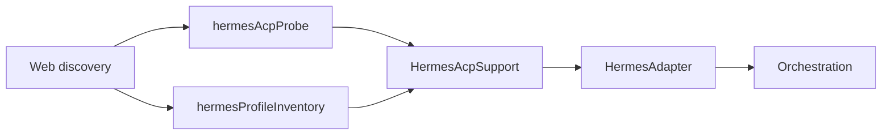

# Hermes Agent integration

Hermes is DP Code's ninth provider. It runs the Hermes Agent CLI (`hermes acp`) over ACP and shares the same orchestration path as Cursor, Gemini, and Pi.

## Vocabulary

- **Hermes profile** — An isolated Hermes configuration home (`HERMES_HOME`), not an OpenCode/Kilo agent. Listed with `hermes profile list`; resolved with `hermes profile show <name>` for the `Path:` value.
- **Thread profile selection** — Per-thread `modelSelection.options.profile`. DP Code sets `HERMES_HOME` from `profile show` when spawning or probing. DP Code never calls `hermes profile use`.
- **Active Hermes profile** — The row marked ◆ in `hermes profile list`. When a thread has no explicit profile, DP Code bootstraps from this profile for discovery and spawn.
- **Idle profile restart** — When a thread session is idle, changing the Hermes profile or profile-scoped reasoning level dispatches `thread.meta.update` and the server restarts the provider session (same pattern as Claude model-option changes).

## Architecture

- **Probe** — Short-lived ACP session: `initialize` → optional `authenticate` → `session/new` → read `models.availableModels`. Shared by `listModels` and provider health (60s cache).
- **Profiles** — `hermes profile list` / `show` subprocess inventory for `listAgents` and `HERMES_HOME` resolution.
- **HermesAcpSupport** — Spawn env, runtime factory, Hermes-specific permission mapping (`acceptForSession` → `allow_session`), model slug helpers.
- **HermesAdapter** — Thin session/turn layer over shared ACP runtime events.

## Auth troubleshooting

1. Install Hermes and ensure `hermes acp --version` works.
2. Configure credentials: run `hermes model` or edit `~/.hermes/.env`.
3. In DP Code Settings → Providers → Hermes, set a custom binary path only if `hermes` is not on PATH.
4. If the health banner shows unauthenticated, fix auth in the active profile home before starting a thread.

## Model IDs

- **Prefixed ACP ids** — e.g. `opencode-go:deepseek-v4-flash` from `session/new` / probe. These are what DP Code persists and sends to `session/set_model`.
- **Placeholder** — `hermes-agent` is a static fallback when discovery has not run; the adapter does not call `session/set_model` for that slug.
- **YAML bare slugs** — Profile config may use bare slugs; discovery normalizes to prefixed ids when Hermes reports them.

## Reasoning

| Path | What it does |
|------|----------------|
| **Display** | Hermes streams `agent_thought_chunk` → `reasoning_text` deltas. DP Code projects these as `agent.reasoning.delta` work-log activities when thinking is enabled in the profile. |
| **Profile control** | `agent.reasoning_effort` in profile `config.yaml`. DP Code reads it during probe, exposes traits as "Profile reasoning level", and applies changes via `hermes config set agent.reasoning_effort <val>` with `HERMES_HOME`, then idle session restart. |

Hermes ACP does not yet expose in-session `configOptions` for reasoning effort. Do not treat the traits control like Cursor's per-turn effort picker.

## Orchestration matrix

| Event | Idle session | Active turn |
|-------|--------------|-------------|
| Profile change | Restart session with new `HERMES_HOME` | Queue meta; restart after turn completes |
| Reasoning effort change | CLI `config set` + restart | Same |
| Model change | In-session `session/set_model` when prefixed id | Same |
| Server restart | Resume via `resumeCursor.sessionId` + same profile home | N/A |

## Version notes

Tested against Hermes Agent 0.14.x ACP: `session/new` returns `models`, `modes`, `sessionId` (no `configOptions` yet).

## Explicit non-goals

- Messaging gateway, cron, voice, profile CRUD UI in DP Code
- Fake ACP in-session reasoning control
- Shared Cursor/Hermes ACP core refactor in the same PR
- Calling `hermes profile use` from DP Code
