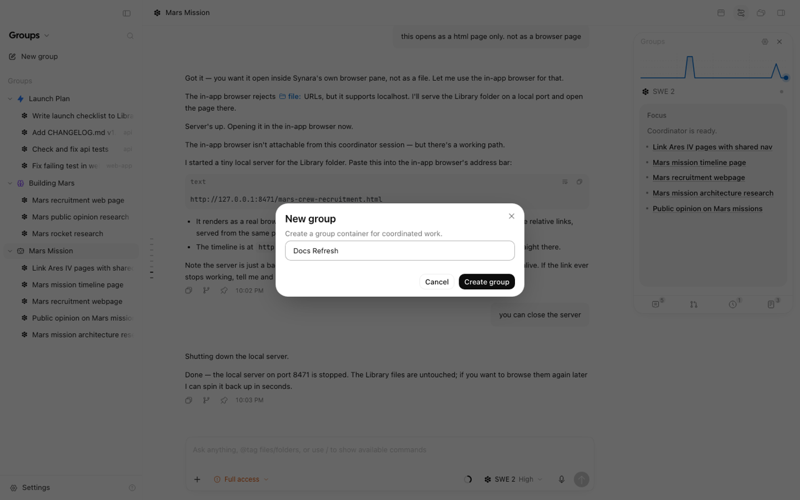
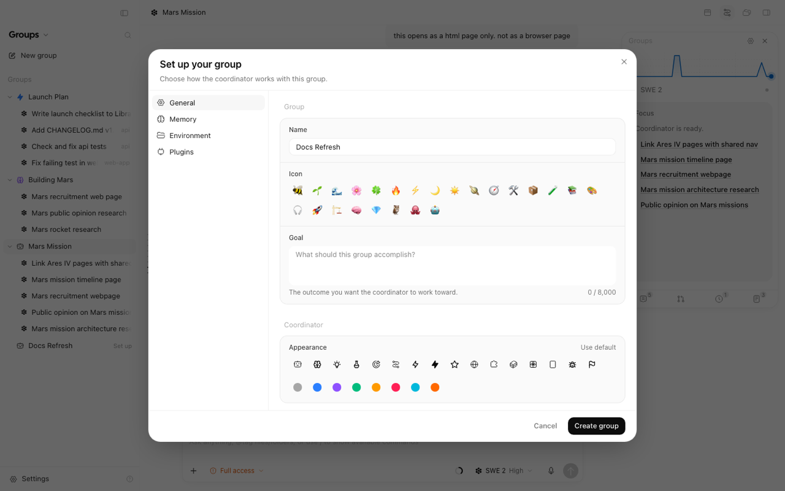
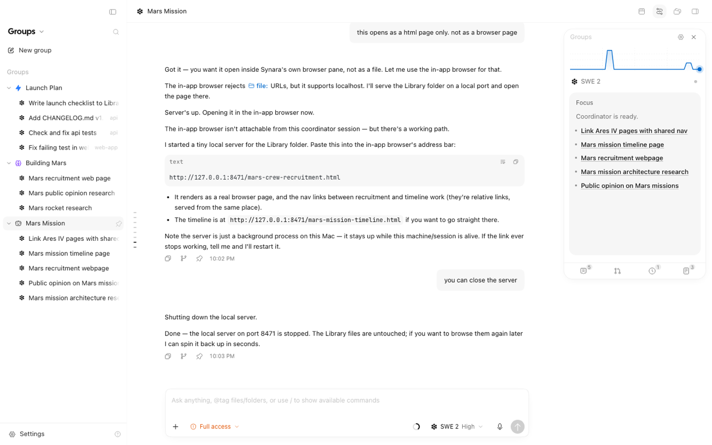
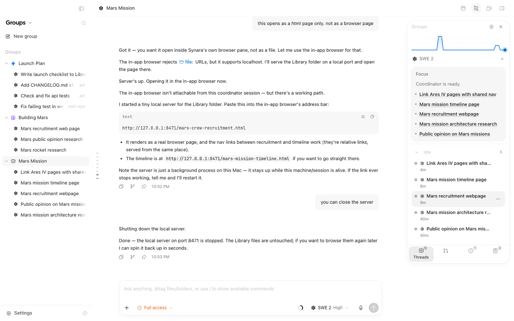
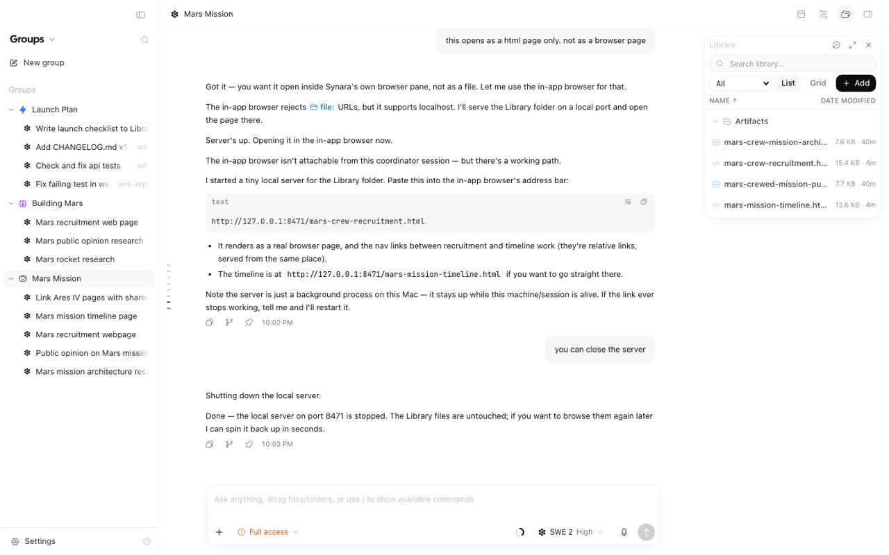
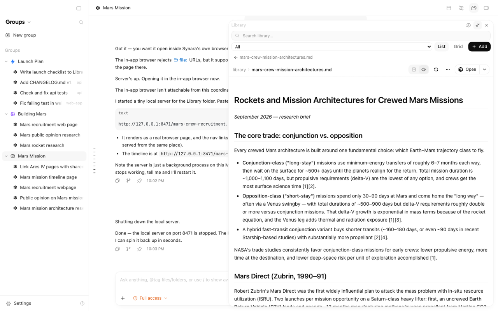

# Groups

A group is a shared home for related work. It has **one coordinator conversation** that you talk
to, and **many threads** that do the work in parallel. Every thread in the group starts from the
same instructions and memory, and files the threads deliver land in one shared Library.

A group does not need a repository. It works just as well for research, writing, planning, or any
other non-code work.

> **Before you begin:** Groups appear under the **Groups** tab of the sidebar switcher. If you do
> not see the tab, open Settings → **Sidebar sections** and turn on **Groups** ("Show the Groups
> tab in the sidebar switcher.").

## Group or ordinary thread?

| Use an ordinary project thread when           | Use a group when                                                  |
| --------------------------------------------- | ----------------------------------------------------------------- |
| The work is one objective in one repository   | The work spans several threads, repositories, or kinds of work    |
| You want to drive a single agent turn by turn | You want one place to ask for work and get status back            |
| Instructions live in that repository          | Several threads should share the same instructions and memory     |
| Results are a diff you review in place        | Results include files (reports, bundles, charts) you want to keep |

## Create a group

1. Open the **Groups** tab in the sidebar and choose **New group**.
2. Type a **Group name** and choose **Create group**. Synara creates a folder for the group under
   `~/Documents/Synara/Groups/`.
3. The **Set up your group** dialog opens. On **General**, set the goal, the coordinator's icon and
   color, and the coordinator and thread models.
4. Optionally add **Group instructions** on **Memory** and link repositories on **Environment**.
5. Choose **Create group**. Setup does not launch a model.



If you choose **Cancel** on a brand-new group that has no threads, files, or linked repositories
yet, Synara asks **Discard this group?** Choose **Discard group** to remove it, or **Keep group** to
finish setup later. A group you keep shows its name with **Set up** in the sidebar; click it to
reopen setup.



The coordinator conversation opens with a welcome message. Until you send your first message, a
**Suggestions** row offers three shortcuts: **Connect repositories**, **Add a goal**, and **Write
instructions**. Each one opens the matching settings section, and hides once that setting is filled.

## Groups in the sidebar

Each group is a single row: its coordinator. There is no separate folder row.

- **Click the row** to open the coordinator conversation.
- **The chevron** on the left shows or hides the group's threads (**Show threads** / **Hide
  threads**). The list includes threads the coordinator started in linked repositories; those rows
  are labelled with the repository name.
- **An amber dot** ("A thread needs you") means a thread in the group is waiting on you.
- **Pin** the coordinator with the pin that appears on hover (**Pin coordinator**), or right-click
  the row and choose **Pin project agent**. Pinned coordinators stay in the pinned section at the
  top of the sidebar.
- **Right-click** the row for **Edit project agent** (opens group settings), **Edit name**, **Open
  in Finder**, and the other folder actions.
- Archived groups are listed under **Archived groups**, each with an **Unarchive** button.

To change the coordinator's icon or color, use group settings → **General** → **Coordinator** →
**Appearance**.

## Talk to the coordinator

The coordinator directs work; threads do the work. It does not write application code itself.
Each message you send ends up in one of three places:

- **Answered in place**: quick questions, status checks, and short explanations.
- **Sent to an existing thread**: a follow-up for a thread already working in that area, instead
  of a duplicate.
- **Started as new threads**: one thread per independent task, started in parallel.

When a request could mean either "do it now" or "just suggest", the coordinator proposes a short
list of suggested threads (title, repository, one-line brief) and waits for your confirmation.
Tell it once if you always want this, and it will remember.

The coordinator's own Synara tools (starting threads, saving memory, adding Library files, linking
repositories) run without asking for approval while the group is active. File edits, shell
commands, and every other tool still ask. In a paused or archived group, every tool asks again.

After it starts threads, Synara watches them for you (see
[How monitoring works](#how-monitoring-works)). Status updates appear in the coordinator
conversation as part of its reply, each with a link to the thread.

Useful requests:

```text
How is everything going?
Run at most 3 threads at a time.
Propose threads before starting them.
Link the repository at ~/code/api to this group.
Every Monday, summarize open pull requests.
```

You can also start a thread in a group yourself: open a new chat while the group is active. The
group's **Thread model** and **Thread effort** are only the starting default for each new chat.
Pick any other model in the composer for that chat. If the default provider is not installed or
signed in, the composer keeps a model that works, so sending is never blocked. The chat still
receives the group's instructions and memory.



## How monitoring works

Monitoring is done by the Synara server, by fixed rules. It does not depend on the model
remembering to check.

- **Every thread the coordinator starts is tracked**, whether or not the group has a goal.
- **Status updates.** When a tracked thread finishes, stops, fails, is interrupted, loses its
  session, or starts waiting for your approval or input, a short line appears in the coordinator
  conversation, for example "Mars rocket research finished", "… is waiting for your approval",
  "… needs your input", or "… was interrupted". A finished thread shows the first line of the
  result it filed, plus its pull request link when it has one. If it filed no result, the line says
  "finished — no result filed".
- **One summary per request.** When a request started more than one thread and all of them are
  done, one summary appears: "All 3 threads finished: …" (or "All 3 threads are done: …" when
  some failed or were interrupted). It lists each thread with its result or outcome and a **PR**
  link. Threads still waiting on you do not count as done.
- **Stuck threads.** The server reacts to events as they happen, and runs a health check every
  minute for the rest:

  | Situation                                                    | What Synara does                                                |
  | ------------------------------------------------------------ | --------------------------------------------------------------- |
  | A turn fails, is interrupted, or the session errors or stops | Reports it and wakes the coordinator                            |
  | The session died but still looks "running" (after 90 s)      | Reports "lost its session" and wakes the coordinator            |
  | Waiting on an approval or your input for over 5 minutes      | Reports it once. It never approves or answers for you           |
  | No session or first turn within 3 minutes of starting        | Re-sends the thread's task once                                 |
  | Running with no real activity for 10 minutes                 | Sends the thread a nudge asking for a one-line status           |
  | Still quiet 5 minutes after the nudge                        | Interrupts the turn and re-sends the thread's task once         |
  | A single tool call running for over 45 minutes               | Nudges and reports, but never interrupts a running tool         |
  | Automatic recovery used up (2 attempts)                      | Marks the thread **Waiting on you**, wakes the coordinator once |

  A **Waiting on you** line has three buttons: **Retry** (re-sends the task), **Stop worker**, and
  **Open thread**. After that, Synara takes no more automatic action on that thread.

- **Your turns are yours.** If you send a message in a thread yourself, Synara never nudges,
  interrupts, or re-sends that turn.
- **Background check-ins stay out of the chat.** The coordinator also runs short background
  check-ins when group events happen. They never appear in the conversation; what each one
  concluded goes to the group's activity log.
- **Paused or archived groups** keep tracking thread state but post no status lines.

## The Groups panel

Open the **Groups** panel with the **Group** button in the chat header. It opens by default in a
group's chats, including a new group's first visit, until you close it; Synara remembers the close
for that group.

From top to bottom:

- **Header**: **Pause goal** / **Resume goal** (only when the group has a goal), **Group
  settings** (gear), and **Close**.
- **Activity graph**: how many threads were working, minute by minute, over the last hour. Hover
  it to see "N threads working now, peak N in the last hour". It is hidden until a thread has done
  some work.
- **Coordinator line**: the coordinator's model, with a status dot (**Needs you**, **Working**,
  **Paused**, **Stopped**, or **Idle**). Click it to open the coordinator conversation.
- **Focus**: a short summary of what matters now, refreshed after coordinator turns, with links to
  the threads involved.
- **Icon bar** at the bottom: **Threads**, **Pull requests**, **Automations**, and **Context**,
  each with a count. An amber dot on **Threads** means a thread is waiting on you. Click an icon
  to open that section in place, above the bar; click it again to close it.

The panel grows with its content up to a height based on your screen; past that, its body scrolls.

The sections:

- **Threads**: every thread in the group, sorted into the states below. Right-click a row (or use
  its **…** button) for **Mark resolved** (or **Reopen**) and **Open in split view**.
- **Pull requests**: PRs opened by group threads, each with an **Open on GitHub** link.
- **Automations**: scheduled work that belongs to the group, with its last run and an on/off
  switch.
- **Context**: the group's Instructions, Decisions, and Playbook files. Only Instructions can be
  edited here.

| State                | Meaning                                                                                            |
| -------------------- | -------------------------------------------------------------------------------------------------- |
| **Waiting on you**   | Asked for an approval or input, its session or turn failed, or monitoring marked it Waiting on you |
| **Working**          | Starting or actively running a turn                                                                |
| **Ready for review** | Not running and has an open, non-draft pull request                                                |
| **Idle**             | Not running and has nothing waiting                                                                |
| **Resolved**         | Archived, its task is done or cancelled, or its PR was merged or closed (collapsed)                |

Threads in linked repositories appear here too, labelled with their repository.



## Instructions and memory

Every turn of every thread in the group, whether the coordinator started it or you did, and
including threads in linked repositories, receives a context packet with:

- The group **instructions**
- The group **goal**, if you set one, plus the group's decisions and open tasks
- The **MEMORY.md** index of shared group memory
- The list of **linked repositories** and the **Library** location
- The group's default thread model

Edit these in group settings → **Memory**:

- **Group instructions**: like a `CLAUDE.md`, rules every new thread reads and follows (up to
  16,000 characters). Changes apply immediately.
- **Write memory notes**: notes the coordinator writes itself as it works. While this is on,
  per-thread memory files (listed under **Thread memory**) are also added to the packet. The
  MEMORY.md index is sent either way.
- **MEMORY.md**: choose **View** to read the coordinator's running memory.
- **Memory files**: every saved memory note. Type in the note box (for example, "Note that
  releases go out on Tuesdays") to add one yourself. Your note is added to the MEMORY.md index
  right away, so every thread sees it on its next turn.

**How "remember" works.** When you tell the coordinator a preference or a fact ("always use the
small model for reviews"), it saves a note and adds one line to the `MEMORY.md` index. A
near-identical note updates the existing file instead of creating a second one. Any group thread
can remember or forget notes the same way. Ask the coordinator to forget a note when it is stale.

## The Library

The Library is a folder of files for the group, versioned as a Git repository. Every change is a
commit. Open it with the **Library** button in the chat header.

- **Add** uploads files. Right-click a folder for **Upload here**.
- Search, filter by type (**All**, **Documents**, **Images**, **Code**, **Other**), sort by name or
  date modified, and switch between **List** and **Grid**.
- Click a file to preview it in the panel.
- Right-click an entry to **Rename**, **Delete**, or see its **History**. The **History** button in
  the Library header shows the history of the whole Library.
- **History** lists every version. Choose **Restore** to bring back an earlier version or a
  deleted file.



Choose **Expand** in the Library header to make the panel as tall as the chat column and much
wider, which is easier for reading documents. **Collapse** returns it to its compact size.



Threads deliver files to the Library themselves: when a thread produces something worth keeping,
the coordinator asks it to add the file, then links the Library path in its reply. A thread can
only add files from its own workspace.

To back up the Library, set a **Git remote** in settings → **Environment** → **Library hosting**
and turn on **Push on change**. Pushes happen in the background and never block a write. The
Library shows **Pushed**, **Not pushed yet**, or **Push failed**. Pushes are non-interactive, so
the remote must already work with your saved SSH key or Git credentials.

## Linked repositories

Link an existing Synara project to let the coordinator start threads in it. Use **Add repository**
in settings → **Environment**, or ask the coordinator to link it. Only you can unlink a repository
(**Remove**). Linking and unlinking apply immediately.

The coordinator can start threads only in the group folder or in a linked repository. It uses the
group folder for non-code work such as notes, research, and planning.

## Lifecycle

These controls live at the bottom of settings → **General**, under **Lifecycle** and **Danger
zone**.

| Action                  | What happens                                                                                                 |
| ----------------------- | ------------------------------------------------------------------------------------------------------------ |
| **Pause group**         | Interrupts running threads and stops new coordinator wakes and group automations. **Resume** restores them   |
| **Restart coordinator** | Stops and restarts the coordinator's session. The transcript is kept. Not available while paused or archived |
| **Archive group**       | Archives every thread and hides the group. Find it under **Archived groups** → **Unarchive**                 |
| **Delete group**        | Type the group name to confirm. Deletes the group, its coordinator, context, and automations                 |

When you delete a group:

- Linked repositories and their threads are never deleted.
- The default Library folder is moved to the trash when possible.
- A Library folder you chose yourself is never moved or deleted; Synara tells you where it was left.
- The group folder under `~/Documents/Synara/Groups/` is removed only when it holds nothing but the
  files Synara created there. If you or a thread added anything, the folder is kept. The delete
  notice lists every kept folder, with a copy button for each path.

**Change the coordinator's model.** Pick a new **Coordinator model** in settings → **General** →
**Models** and save. The coordinator moves to that model and keeps its conversation history. If
that provider is turned off or not installed, the save is refused and the coordinator keeps running
on its old model.

**Continue as a group.** Right-click an ordinary thread and choose **Continue as a group**. Synara
creates a new group named after the thread, links the thread's project, and opens group setup. The
coordinator is then asked to read the thread and continue its work. **Move to group…** does the
same for an existing group.

**Hand off.** Group threads can hand off to another provider, and the new thread stays in the
group. Workspace hand off (to a new worktree or to local) is not available for group threads. The
coordinator cannot be handed off.

## Settings reference

Open settings from the gear in the Groups panel (**Group settings**), or right-click the group in
the sidebar and choose **Edit project agent**. The model pickers list every provider's models, just
like the composer.

| Section         | Settings                                                                                                                                     |
| --------------- | -------------------------------------------------------------------------------------------------------------------------------------------- |
| **General**     | Group (Name, Icon, Goal); Coordinator (Appearance: icon and color); Models (Coordinator and Thread model and effort); Lifecycle              |
| **Memory**      | Group instructions; Auto memory (Write memory notes, MEMORY.md); Memory files; Thread memory                                                 |
| **Environment** | Linked repositories; Workspace (Group folder, Worker environment: Local or Worktree); Library hosting (Location, Git remote, Push on change) |
| **Plugins**     | Plugins discovered from the group's folder                                                                                                   |

## Where data lives on disk

| Data                            | Location                                                             |
| ------------------------------- | -------------------------------------------------------------------- |
| Group folder                    | `~/Documents/Synara/Groups/<group-name>/`                            |
| Instructions, memory, decisions | `~/.synara/userdata/project-context/<project-id>/` (Markdown mirror) |
| Library (default)               | `~/.synara/userdata/project-context/<project-id>/library/`           |
| Library (custom)                | The folder you chose in **Library hosting** → **Location**           |

Synara's database is the source of truth; the Markdown files are a mirror. `~/.synara` moves if you
set `SYNARA_HOME`.

## Limits and troubleshooting

- A group runs at most 8 threads at once and starts at most 8 new threads per coordinator turn.
- The context packet is capped at 32,000 characters. Past that, lower-priority sections (memory
  files, decisions, tasks) truncate first. Instructions and the MEMORY.md index are always kept.
- A single Library add is limited to 256 MB. The MEMORY.md index keeps the newest 256 entries.
- Group name: 160 characters. Goal: 8,000. Instructions: 16,000.
- Library remotes must be `https://`, `ssh://`, or `git@host:path`.
- **No Groups tab**: turn on Settings → **Sidebar sections** → **Groups**.
- **Restart is greyed out**: resume or unarchive the group first.
- **Push failed**: hover the pill to see the error; failed pushes retry with a growing delay up to
  10 minutes.
- **A thread is stuck on Waiting on you**: open the coordinator conversation and choose **Retry**,
  **Stop worker**, or **Open thread** on that thread's line.
- **A paused or archived group is missing from Move to group…**: only active groups are listed.

## How Groups compare to Claude Code and Cursor Projects

Groups follow the same idea as Claude Code
[Projects](https://code.claude.com/docs/en/claude-projects) and Cursor Projects: one place that
holds shared instructions, memory, and files for related work. Synara adds a coordinator that starts
threads for you, server-side monitoring that reports on and recovers those threads, a live panel of
every thread and PR, and a Git-versioned Library. Threads can use any provider Synara supports, and
a group can span several repositories or none.
