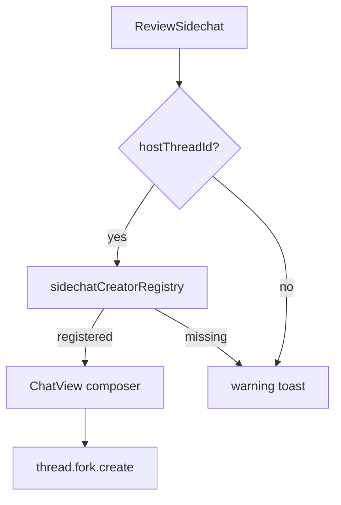
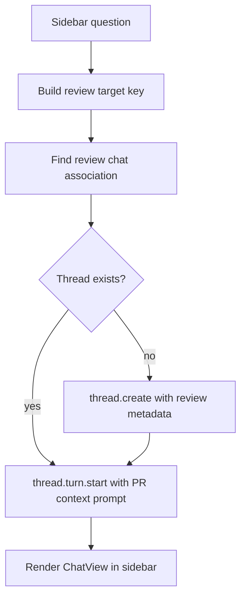
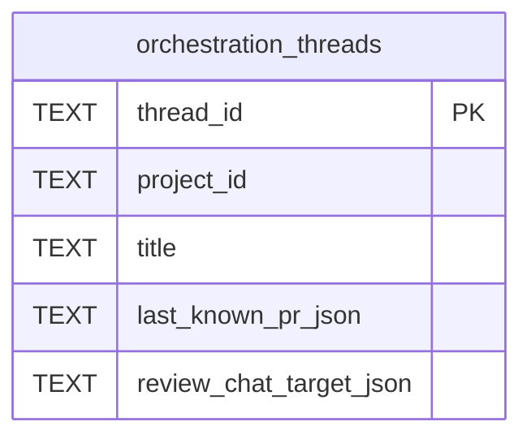

# feat: Add review-bound sidebar chat threads

## Summary

This plan makes the PR review sidebar create and reuse a durable Synara thread tied to the review target. The chat runs from PR metadata, loaded diff context, checks, comments, and the main/local workspace, without forking an unrelated conversation or creating a worktree.

---

## Problem Frame

The current review sidebar chat is wired through the regular ChatView `/side` creator. `ReviewSidechat` requires a `hostThreadId`, looks up a registered sidechat creator, and falls back to warning toasts when the review page is opened directly. That works only inside a server-backed chat dock because `useComposerSlashCommands` registers the creator from an existing ChatView thread.

Review pages are PR-first surfaces. They should not depend on an arbitrary conversation host, and they should not inherit unrelated transcript context. The correct model is a review-owned chat thread keyed by the PR review target.

---

## Requirements

**Review chat lifecycle**

- R1. The right sidebar must create a server-backed chat thread automatically when the user sends the first review-chat message.
- R2. The same PR review target must reopen the same review chat thread across route changes, tab switches, and app reloads.
- R3. Direct `/review/$reference` routes must support chat creation without a `hostThreadId`.
- R4. Docked review views opened from an existing chat thread must use the same review-bound behavior as direct review routes.

**Runtime boundaries**

- R5. Review chat threads must use `approval-required` runtime mode and local environment mode by default.
- R6. Review chat creation must not create a worktree, checkout a PR branch, or fork an existing transcript.
- R7. The first prompt must include the loaded PR context and a clear boundary that the agent is reviewing, answering questions, and drafting comments unless the user explicitly asks for implementation work.

**UI behavior**

- R8. The sidebar must show loading, creating, unavailable, empty, and active chat states without disabled dead ends.
- R9. Suggested prompts and typed questions must route through the same creation/reuse path.
- R10. The active chat must render with existing ChatView primitives inside the sidebar once a review thread exists.

**Reliability**

- R11. Concurrent sends for the same review target must create at most one chat thread.
- R12. If thread creation succeeds but the first turn fails, the UI must keep the created thread and let the user retry the turn.
- R13. If a persisted review-chat association points to a deleted or missing thread, the UI must self-heal by creating a new association on next send.

---

## High-Level Technical Design

### Current coupling

The failure is structural: direct review routes have no ChatView host, so no creator is registered.

### Target lifecycle

The review chat is a first-class thread. It is not a sidechat fork, so `sidechatSourceThreadId` remains `null`.

### Review association

The plan adds explicit review-chat metadata to thread projection state. `lastKnownPr` stays useful for display, but `reviewChatTarget` is the canonical lookup key for "which thread owns chat for this PR review."

---

## Key Technical Decisions

- **Use `thread.create`, not `thread.fork.create`:** Review chat should not inherit arbitrary transcript history. A clean thread seeded with PR context gives deterministic behavior and avoids the existing host-thread dependency.
- **Persist a canonical review target on the thread:** `lastKnownPr` identifies recent PR context but does not mean "this is the review chat for this PR." Add review-specific metadata so lookup is exact and durable.
- **Keep the runtime local and approval-required:** The sidebar is for review assistance. It should not mutate the repo or create a worktree unless the user later asks for implementation work from inside the chat.
- **Build creation as a reusable review-chat service/hook:** Suggested prompt buttons and manual composer submit must share one path, with in-flight de-duplication by review target.
- **Render existing ChatView after creation:** The chat surface should reuse current transcript, composer, streaming, and approval primitives rather than introducing a parallel mini-chat implementation.

---

## Scope Boundaries

### In Scope

- Creating and reusing a review-bound thread from the right sidebar.
- Adding enough thread metadata and projection support to look up that thread by review target.
- Replacing the host-thread-only `ReviewSidechat` path.
- Focused tests for metadata projection, creation de-duplication, sidebar states, and direct review route behavior.

### Deferred to Follow-Up Work

- Posting chat answers directly as GitHub comments.
- Full review-agent tools that can run commands or inspect files beyond loaded review context.
- Migrating all sidechat semantics away from `sidechatSourceThreadId`.
- Deep prompt tuning for long diffs beyond the existing compact PR context payload.

### Out of Scope

- Worktree creation during review chat startup.
- Branch checkout or PR implementation flows from the initial sidebar chat.
- Replacing the existing ChatView transcript/composer primitives.

---

## Implementation Units

### U1. Add review chat target metadata to orchestration threads

- **Goal:** Make a server-backed thread able to declare that it is the canonical chat for a review target.
- **Requirements:** R2, R11, R13
- **Dependencies:** none
- **Files:**
  - `packages/contracts/src/orchestration.ts`
  - `packages/contracts/src/orchestration.test.ts`
  - `apps/server/src/orchestration/decider.ts`
  - `apps/server/src/orchestration/projector.ts`
  - `apps/server/src/orchestration/projector.test.ts`
  - `apps/server/src/orchestration/Layers/ProjectionPipeline.ts`
  - `apps/server/src/orchestration/Layers/ProjectionPipeline.test.ts`
  - `apps/server/src/orchestration/Layers/ProjectionSnapshotQuery.ts`
  - `apps/server/src/orchestration/Layers/ProjectionSnapshotQuery.test.ts`
  - `apps/server/src/persistence/Migrations.ts`
  - `apps/server/src/persistence/Migrations/<next>_ReviewChatTarget.ts`
  - `apps/server/src/persistence/Layers/ProjectionThreads.ts`
- **Approach:** Add a nullable `reviewChatTarget` field to the thread contract, `thread.create`, `thread.meta.update`, `thread.created`, and `thread.meta-updated` payloads. Shape it around existing review target identity: cwd/project scope plus PR reference, number, repository id when available, and source URL when available. Add the matching nullable JSON column to persisted thread rows and keep `sidechatSourceThreadId` untouched.
- **Patterns to follow:** Existing `lastKnownPr`, `sidechatSourceThreadId`, `handoff`, and migration/projection thread plumbing.
- **Test scenarios:**
  - Decode a `thread.create` command with `reviewChatTarget` and assert the emitted `thread.created` payload preserves it.
  - Decode legacy thread events without `reviewChatTarget` and assert they default to `null`.
  - Apply `thread.meta.update` with a new `reviewChatTarget` and assert projection/shell snapshots expose it.
  - Run a migration-backed projection write/read and assert the nullable JSON column round-trips.
  - Persist and reload a thread row with `reviewChatTarget` JSON through `ProjectionSnapshotQuery`.
- **Verification:** Shell snapshots and web store thread summaries can distinguish review-chat threads from ordinary threads that only have `lastKnownPr`.

### U2. Build review chat thread resolution and creation

- **Goal:** Provide one helper that finds or creates the review chat thread for a PR target and optionally starts a turn.
- **Requirements:** R1, R2, R3, R5, R6, R7, R11, R12, R13
- **Dependencies:** U1
- **Files:**
  - `apps/web/src/lib/reviewChatThread.ts`
  - `apps/web/src/lib/reviewChatThread.test.ts`
  - `apps/web/src/components/review/reviewSidechatContext.ts`
  - `apps/web/src/storeSelectors.ts`
  - `apps/web/src/types.ts`
- **Approach:** Create a small web helper that resolves the project from `cwd`, finds an existing thread whose `reviewChatTarget` matches the PR target, validates that it still exists, and dispatches `thread.create` when missing. Use the project default model when present, otherwise the Codex default model. Create threads with `runtimeMode: "approval-required"`, `interactionMode: "default"`, `envMode: "local"`, `branch: baseBranch`, `worktreePath: null`, `reviewChatTarget`, and `lastKnownPr`.
- **Technical design:** Directional guidance, not implementation specification:
  - Resolve project by workspace-root equality, not raw string equality.
  - Key in-flight creation by normalized review target.
  - Dispatch `thread.create` through `promoteThreadCreate` so duplicate-create races self-heal.
  - Dispatch `thread.turn.start` only after thread creation/reuse is confirmed.
- **Patterns to follow:** `resolveFirstSendTarget`, `promoteThreadCreate`, `newThreadId`, `newCommandId`, and project matching in `chatFirstSend`.
- **Test scenarios:**
  - Given an existing matching review-chat thread, sending a question starts a turn on that thread and does not dispatch `thread.create`.
  - Given no matching thread, sending a question dispatches one `thread.create` and one `thread.turn.start`.
  - Given two concurrent sends for the same review target, only one `thread.create` is dispatched.
  - Given a missing project for `cwd`, the helper returns an unavailable state that the UI can explain.
  - Given thread creation succeeds and turn start fails, the result preserves the created thread id for retry.
- **Verification:** Direct review pages can start a chat without `hostThreadId`, and the created thread appears in shell snapshot data with review metadata.

### U3. Replace host-thread-only sidebar chat behavior

- **Goal:** Make `ReviewSidechat` use review-bound thread creation instead of the sidechat creator registry.
- **Requirements:** R1, R3, R8, R9, R10, R12
- **Dependencies:** U2
- **Files:**
  - `apps/web/src/components/review/ReviewSidechat.tsx`
  - `apps/web/src/components/review/ReviewPrSidebar.tsx`
  - `apps/web/src/components/review/ReviewPrSidebar.browser.tsx`
  - `apps/web/src/components/review/ReviewPrView.visual.browser.tsx`
- **Approach:** Remove the hard dependency on `hostThreadId` for PR chat. `hostThreadId` may remain as optional context for docked layouts, but it should not gate chat availability. Use the new review-chat helper for suggestion buttons and composer submits. Render `ChatView` with the resolved review thread id after creation or lookup.
- **Patterns to follow:** Existing `ChatView` embedded rendering in `ReviewSidechat`, current composer shell styles, and existing loading-state conventions from recent review surface work.
- **Test scenarios:**
  - Direct review route sidebar shows an enabled chat composer when PR context is loaded and no host thread exists.
  - Clicking a suggestion creates or reuses the review chat thread and renders `ChatView`.
  - Typing a question and pressing Enter follows the same path as clicking a suggestion.
  - Failure to create a thread shows a retryable error state, not a permanent disabled composer.
  - Existing docked review views continue to render and no longer require the host sidechat registry.
- **Verification:** The warning copy "Open a Synara thread first" disappears from the PR sidebar path.

### U4. Add review-specific prompt boundaries

- **Goal:** Seed the review chat with clear PR context and mutation boundaries.
- **Requirements:** R5, R6, R7
- **Dependencies:** U2
- **Files:**
  - `apps/web/src/components/review/reviewSidechatContext.ts`
  - `apps/web/src/components/review/reviewSidechatContext.test.ts`
- **Approach:** Extend `buildReviewSidechatInitialPrompt` so the first turn states that the agent is helping review a PR, can answer questions and draft review comments, and should not create worktrees, check out branches, or mutate files unless the user explicitly asks for implementation work. Keep the existing compact context structure for checks, changed files, recent conversation, and PR body.
- **Patterns to follow:** Current `ReviewSidechatContextPayload` truncation and `ProviderCommandReactor` sidechat boundary behavior.
- **Test scenarios:**
  - Initial prompt includes PR number, title, repository id or fallback, branch direction, stats, checks, changed files, recent conversation, and PR body.
  - Initial prompt includes the no-worktree/no-mutation boundary.
  - Empty checks, files, conversation, or body render explicit fallback lines.
  - Long PR body and file lists remain bounded.
- **Verification:** First-turn prompt is useful for review assistance without importing unrelated transcript messages.

### U5. Wire route-level hydration and self-healing

- **Goal:** Reopen existing review chat threads before the user sends when possible, and recover from stale associations.
- **Requirements:** R2, R8, R10, R13
- **Dependencies:** U1, U2, U3
- **Files:**
  - `apps/web/src/components/review/ReviewPrView.tsx`
  - `apps/web/src/components/review/ReviewPrSidebar.tsx`
  - `apps/web/src/components/review/ReviewSidechat.tsx`
  - `apps/web/src/storeSelectors.ts`
  - `apps/web/src/components/review/ReviewPrSidebar.browser.tsx`
- **Approach:** Derive the matching review chat thread from store state while the PR detail is loaded. Pass the existing thread id into `ReviewSidechat` so the sidebar can render the active chat immediately. If the matching id disappears from the store, clear the active id and let the next send create a replacement.
- **Patterns to follow:** Stable selector factories in `storeSelectors` and `ReviewPrView` memoization around PR context.
- **Test scenarios:**
  - When a matching review-chat thread is already in state, the sidebar renders `ChatView` without another create call.
  - Changing PR tabs switches to the matching review chat for the new target or the empty prompt for no match.
  - Deleting or archiving the matching thread clears the active sidebar chat state.
  - Loading skeletons do not flash a disabled chat composer before PR context is available.
- **Verification:** Returning to a PR shows the same chat without sending another message.

### U6. Focus verification on contracts, creation, and UI states

- **Goal:** Prove the review-bound chat flow works without running heavyweight workspace checks during iteration.
- **Requirements:** R1-R13
- **Dependencies:** U1, U2, U3, U4, U5
- **Files:**
  - `packages/contracts/src/orchestration.test.ts`
  - `apps/server/src/orchestration/projector.test.ts`
  - `apps/server/src/orchestration/Layers/ProjectionPipeline.test.ts`
  - `apps/server/src/orchestration/Layers/ProjectionSnapshotQuery.test.ts`
  - `apps/web/src/lib/reviewChatThread.test.ts`
  - `apps/web/src/components/review/ReviewPrSidebar.browser.tsx`
  - `apps/web/src/components/review/ReviewPrView.visual.browser.tsx`
- **Approach:** Keep verification targeted to the new contract field, projection persistence, helper behavior, and browser-visible sidebar states. Follow project guidance by avoiding `bun fmt`, `bun lint`, and `bun typecheck` unless explicitly requested.
- **Test scenarios:**
  - Contract and server projection tests cover all new metadata paths and legacy decode compatibility.
  - Web unit tests cover lookup, creation, de-duplication, first-turn dispatch, and failure recovery.
  - Browser tests cover direct review route chat availability, suggestion submit, manual submit, active ChatView rendering, and stale association recovery.
- **Verification:** The implementation can be validated with focused Vitest and browser-component suites before any optional full workspace verification.

---

## Risks & Mitigations

- **Metadata expansion touches shared orchestration contracts:** Keep the field nullable and defaulted so legacy snapshots and events decode unchanged.
- **Thread lookup can become ambiguous:** Key by normalized project/workspace plus PR identity, and prefer exact `reviewChatTarget` matches over `lastKnownPr`.
- **Review chat might accidentally mutate the repo:** Pin runtime to `approval-required`, local env mode, null worktree, and include explicit prompt boundaries.
- **Embedded ChatView can be heavy in the sidebar:** Reuse the existing lazy rendering pattern and only mount ChatView after a real thread id exists.
- **Project resolution may fail on direct review routes:** Show a clear unavailable state when `cwd` is missing or no matching project exists, and preserve the existing project picker path.

---

## Sources & Research

- `.plans/19-full-pr-review-experience.md` defines the broader review surface direction and sidebar/chat context.
- `.plans/20-github-sync-cache.md` and `.plans/review-cache-instant-open-plan.md` establish the review data/cache direction this plan should not disrupt.
- `apps/web/src/components/review/ReviewSidechat.tsx` currently gates chat on `hostThreadId` and `sidechatCreatorRegistry`.
- `apps/web/src/hooks/useComposerSlashCommands.ts` shows the current `/side` implementation via `thread.fork.create`.
- `packages/contracts/src/orchestration.ts`, `apps/server/src/orchestration/decider.ts`, and projection files show the thread metadata plumbing to extend.
- `apps/web/src/lib/threadCreatePromotion.ts` gives the idempotent thread-create helper to reuse.
- `apps/web/src/components/review/reviewSidechatContext.ts` already builds the compact PR context payload for the first review-chat turn.
