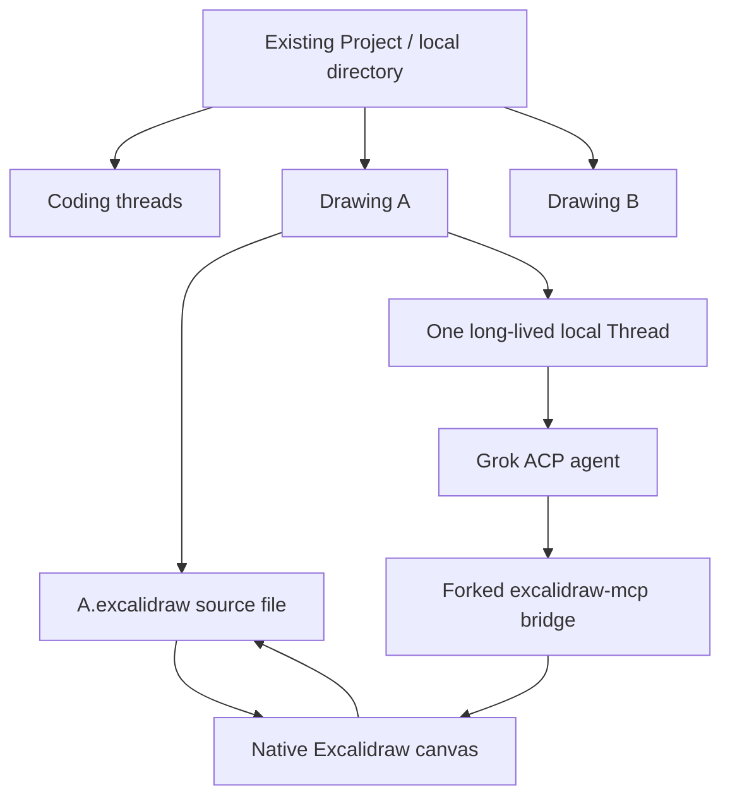
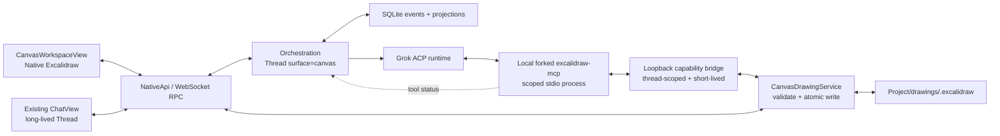
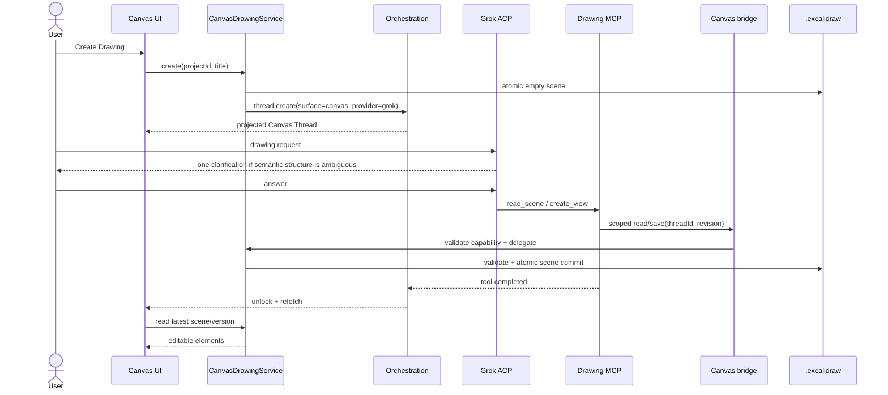
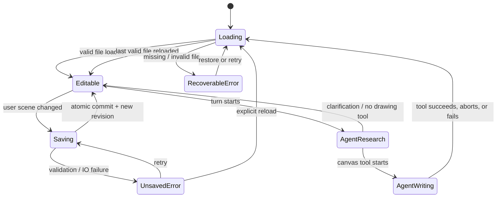
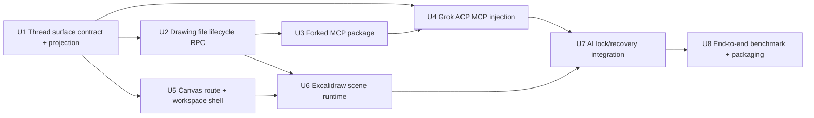

# AI Canvas Workspace - Plan

## Goal Capsule

- **Objective:** 在 Synara 中增加以 Excalidraw 为核心的 Canvas workspace，让用户可以与 Grok agent 长期协作，将自然语言、代码研究或文档研究结果转化为可继续编辑的结构化图。
- **Product authority:** 本文记录 2026-07-14 与产品所有者确认的产品行为、首版范围和验收标准；后续规划可以决定实现细节，但不能改写这些产品决策。
- **Open blockers:** 无。稳定 Drawing 身份、数据库关系、MCP 进程边界和文件监听策略留给实现规划确定。
- **Execution profile:** 跨 contracts、SQLite projection、server workspace/runtime、Grok ACP、MCP 子进程与 React/Excalidraw UI 的 Deep 实施；按依赖顺序完成 schema → 文件/runtime → provider → UI → 端到端恢复。
- **Tail ownership:** 实施者负责本地 fork 归档、迁移兼容、聚焦测试、真实浏览器验收、PR 与 CI；任何未完成的外部阻塞必须在交付说明中明确列出。
- **Stop conditions:** 只有在创建/重开 Drawing、人工保存、AI 工具写入、Grok session 恢复、中断/失败解锁及 TCP/IP 基准路径均有可观察证据后才可交付。

---

## Product Contract

### Summary

Synara 将增加一个新的顶层 Canvas workspace，并继续使用现有 Project 表示用户选择的本地目录。每个 Project 可以同时拥有编码对话和多张 Drawing；每张 Drawing 对应一个可持久化的 `.excalidraw` 文件，以及一个固定、长期、仅存于本机数据库的 Grok ACP 对话。用户在中间的原生 Excalidraw 画布查看和编辑结构化图，并在右侧持续与 AI 协作。

### Problem Frame

现有 Synara 的核心交互以 agent 对话和代码编辑为中心，无法把 agent 对代码、文档或一般概念的理解直接沉淀为可反复修改的视觉资产。Mermaid 适合快速表达关系，但成图风格较朴素、自由布局能力有限；HTML 输出信息密度往往过高，也不是理想的可编辑图形源文件。用户需要的是一种 canvas-first 的工作方式：AI 负责研究、组织和绘制，用户可以继续手工调整，并在同一个长期上下文里要求 AI 迭代。

### Key Decisions

- **Canvas 是 Synara 内的新 workspace。** 它不是独立应用，也不创建另一套 Project 体系；同一个本地 Project 可以同时承载代码工作与绘图工作。
- **Drawing 是一等实体。** 一个 Project 可包含多张 Drawing，每张 Drawing 拥有稳定身份、一个 `.excalidraw` 内容文件和一个固定的长期对话。
- **结构化图是首要输出。** 首版产物必须能在 Excalidraw 中逐元素选择、移动、编辑和继续生成；生成式位图只作为后续补充能力。
- **原生画布归 Synara 所有。** 主界面直接嵌入 `@excalidraw/excalidraw`，不把 MCP App iframe 当成产品主画布。
- **基于 fork 集成 MCP。** 本地 fork `excalidraw/excalidraw-mcp`，复用它的元素格式、场景创建、恢复、删除、checkpoint 和流式更新思路，并将输出桥接到 Synara Drawing runtime；不从零重写一个 MCP。
- **首版只承诺 Grok ACP。** 现有 provider 架构继续保留，但 Canvas 的 MCP 注入、会话恢复和绘图调用先在 Grok ACP 路径打通，再推广到其他 provider。
- **AI 与人工编辑串行。** AI 绘图时用户可以查看、缩放、平移和中断，但不能同时修改元素，以避免冲突和损坏。
- **语义歧义先澄清。** 当不同选择会改变图的事实结构时，AI 先问一个聚焦问题；布局、配色等非结构性选择由 AI 使用合理默认值。

### Actors

- A1. 用户：创建、打开、编辑 Drawing，并通过长期对话要求 AI 研究、绘制和修改。
- A2. Grok ACP agent：理解请求、在必要时澄清、研究可用上下文，并通过绘图工具读取或修改当前场景。
- A3. Drawing runtime：维护画布状态、串行化编辑、执行 MCP 场景变更、持久化文件，并在失败时保持可恢复状态。
- A4. Synara orchestration：维护 Project、Drawing、Thread 及 provider session 的本地关系和生命周期。

### Requirements

**Workspace and navigation**

- R1. Synara 必须提供独立于 Chat 和 Editor 的顶层 Canvas workspace，并保持其属于同一个产品外壳和导航体系。
- R2. Canvas workspace 必须使用三栏协作布局：左侧 Project/Drawing 导航、中间主画布、右侧固定长期对话。
- R3. 现有 Project 必须继续代表用户选择的本地目录，并能同时包含现有编码线程和任意数量的 Drawing。
- R4. 用户必须能够在 Project 内创建、命名、打开、切换和删除 Drawing，并能从左侧导航识别当前 Drawing。
- R5. 打开 Drawing 时，中间区域必须显示原生 Excalidraw 画布；右侧对话可以调整宽度或隐藏，但不能因隐藏而销毁会话状态。

**Drawing identity and persistence**

- R6. 每张 Drawing 必须拥有稳定身份，不能只依赖易变化的显示名称来关联文件和对话。
- R7. 每张 Drawing 的结构化内容必须持久化为其 Project 目录内的 `.excalidraw` 文件，并以该文件作为场景内容的事实来源。
- R8. 每张 Drawing 必须固定关联一个长期 Thread；后续打开、编辑和 AI 请求都继续使用该 Thread，而不是自动新建短会话。
- R9. Drawing 与 Thread 的关系、对话消息和 provider session 元数据必须沿用 Synara 的本机数据库持久化方式，不在 Project 内创建对话 sidecar 文件。
- R10. 重启 Synara 或重新打开 Project 后，系统必须恢复 Drawing 内容及其原有长期对话，并让用户从上次上下文继续工作。
- R11. 用户或 AI 产生的有效场景变更必须可靠保存；写入失败不能静默丢失已确认的画布状态。

**AI collaboration behavior**

- R12. 用户必须能用自然语言要求 AI 新建任意结构化图，或基于当前场景进行局部修改、重排、补充和删除。
- R13. Agent 在执行修改前必须能够读取当前 Drawing 的结构和必要上下文，避免把每次请求当作空白画布重新生成。
- R14. 当请求存在会改变事实结构的歧义时，AI 必须先提出一个聚焦澄清问题；当差异只涉及视觉风格时，AI 应直接采用合理默认值。
- R15. AI 进入场景写入阶段后，Drawing runtime 必须暂时锁定人工元素编辑，同时保留查看、缩放、平移和中断能力。
- R16. AI 修改必须作为边界清晰的场景操作应用；完成后解锁编辑，失败或中断后也必须解锁，并保留最近一次有效场景。
- R17. AI 的局部修改必须尽量保留未被请求影响的元素、用户手工调整和稳定元素身份，不能无理由整图重建。
- R18. 对话必须清楚显示 AI 正在研究、等待澄清、绘图、完成、失败或已中断的状态，让用户能够判断当前是否可编辑。

**Integration and quality**

- R19. 首版必须通过 Grok 的 ACP runtime 向 agent 提供 Drawing MCP 工具，并支持新会话、恢复会话和重新连接后的持续使用。
- R20. MCP 适配必须建立在本地 fork 的 `excalidraw-mcp` 上，并保留可追踪的上游来源，以便后续选择性同步上游改进。
- R21. Synara 必须拥有主画布和持久化生命周期；MCP 层负责向 agent 暴露场景能力，不能以嵌入式 MCP App 替代 Canvas workspace。
- R22. 首版生成的图必须由可编辑的 Excalidraw 元素构成，并能表达层级、容器、连线、标签和方向等常见架构关系。
- R23. AI 绘图结果必须优先保证语义正确、层次清晰和可读性，再优化装饰性风格。

### Key Flows

- F1. 创建并首次绘图
  - **Trigger:** A1 在某个 Project 中创建 Drawing 并输入绘图请求。
  - **Actors:** A1, A2, A3, A4
  - **Steps:** 系统创建稳定 Drawing 身份、`.excalidraw` 文件和固定 Thread；A2 判断是否需要澄清；A3 锁定编辑并应用 MCP 场景操作；有效结果保存后解锁。
  - **Outcome:** 用户看到一张可编辑的结构化图，并能在同一对话中继续迭代。
  - **Covers:** R3-R9, R12-R16, R19-R23

- F2. 继续已有 Drawing
  - **Trigger:** A1 重新打开曾经编辑过的 Drawing。
  - **Actors:** A1, A2, A3, A4
  - **Steps:** 系统加载 `.excalidraw` 场景和关联 Thread；A2 可读取当前结构与对话上下文；新的修改只影响请求涉及的部分。
  - **Outcome:** 文件、对话和 AI 上下文连续，用户无需重新解释整张图。
  - **Covers:** R6-R13, R17

- F3. 人工编辑后交给 AI 修改
  - **Trigger:** A1 手工移动、改写或新增元素后提出后续请求。
  - **Actors:** A1, A2, A3
  - **Steps:** A3 保存人工修改；A2 读取最新场景；A3 串行应用 AI 的局部场景操作，并保护无关元素。
  - **Outcome:** 人工与 AI 的修改在同一份结构化源文件上累积。
  - **Covers:** R11-R13, R15-R17

- F4. 绘图失败或被中断
  - **Trigger:** A1 中断绘图，或 MCP、provider、持久化过程失败。
  - **Actors:** A1, A2, A3, A4
  - **Steps:** 当前操作停止；A3 丢弃或回退未完成的无效变更；恢复最近一次有效场景；解除人工编辑锁；对话展示结果和可恢复状态。
  - **Outcome:** Drawing 不损坏，用户可以继续手工编辑或再次请求 AI。
  - **Covers:** R11, R15, R16, R18, R19

### Workspace Relationship

### Acceptance Examples

- AE1. TCP/IP 分层架构图
  - **Covers:** R12, R14, R22, R23
  - **Given:** 用户在空白 Drawing 中输入“绘制 TCP/IP 协议栈架构图，看到正确的分层架构展示”。
  - **When:** 采用四层还是五层会改变图的结构。
  - **Then:** AI 先用一个问题确认分层模型，再绘制方向一致、层次清晰、协议归属正确、元素可单独编辑的架构图。

- AE2. 基于人工修改继续绘图
  - **Covers:** R13, R15-R17
  - **Given:** 用户已经移动一个层级并手工改写标签。
  - **When:** 用户要求 AI 只补充各层的数据单元和示例协议。
  - **Then:** AI 读取最新场景，只补充请求内容，并保留用户的布局调整和无关元素。

- AE3. 重启后继续长期对话
  - **Covers:** R6-R10, R19
  - **Given:** Drawing 已经历多轮人工和 AI 修改。
  - **When:** 用户重启 Synara 并再次打开该 Drawing。
  - **Then:** 系统恢复相同 `.excalidraw` 内容及相同 Thread，用户可以引用之前讨论过的概念继续修改。

- AE4. 中断未完成的 AI 绘图
  - **Covers:** R11, R15, R16, R18
  - **Given:** AI 正在流式修改一个已有场景。
  - **When:** 用户中断操作或 MCP 进程异常退出。
  - **Then:** 系统停止本次操作、恢复最近一次有效场景、解除编辑锁，并在对话中显示可理解的失败或中断状态。

### Success Criteria

- 基准请求可以产出语义正确的 TCP/IP 分层图，而不是只有视觉上类似分层的错误内容。
- AI 生成的主要节点、连线、标签和容器均可在 Excalidraw 中独立选择和编辑。
- 用户能够在同一 Project 内自然切换编码线程与多张 Drawing，不需要管理两套目录或项目概念。
- 任意 Drawing 在应用重启后仍能恢复文件、固定对话和继续协作所需的上下文。
- 正常完成、用户中断、agent 失败和保存失败都不会留下损坏的 `.excalidraw` 文件或永久编辑锁。
- AI 对已有图的局部修改不会无理由覆盖用户调整或重建整张图。

### Scope Boundaries

**Deferred for later**

- 面向代码仓库的专用研究流程，例如自动扫描项目后生成依赖图或架构图。
- 面向文档集合的专用研究流程，例如概念抽取、引文追踪和知识图谱生成。
- ChatGPT 风格的生成式位图与结构化 Excalidraw 场景混合创作。
- 动画时间线、镜头编排、视频渲染和自媒体导出。
- Grok 之外的 Codex、Claude、Cursor、Gemini 等 provider 的正式 Canvas 支持。
- 实时多人协作，以及 AI 写入期间的无锁并发人工编辑。

**Outside this product's identity**

- 用 Mermaid 或 HTML 文档作为 Canvas workspace 的主要可编辑源格式。
- 将 `excalidraw-mcp` 自带 MCP App iframe 直接包装成 Synara 的完整绘图产品。
- 为 Canvas 再创建一套与现有 Synara Project、Thread 和 orchestration 平行的应用或数据库。

### Dependencies / Assumptions

- `@excalidraw/excalidraw` 的嵌入式 React API 能支持场景读取、更新、保存及必要的编辑状态控制。
- Grok CLI 的 ACP 实现允许 Synara 在创建和恢复 session 时注入 MCP server 配置。
- 本地 fork 的 `excalidraw-mcp` 许可证和元素模型允许在 Synara 内修改、分发和持续维护。
- Synara 现有本地 SQLite orchestration 可以扩展 Drawing 与 Thread 的关系，而不改变“对话只存本机”的产品承诺。
- Project 目录在绘图期间可写；只读目录、外部文件冲突和跨设备同步的具体策略由实现规划定义。

### Sources / Research

- `apps/web/src/components/EditorWorkspaceView.tsx`：现有左侧工作区、中间内容和右侧对话布局可作为 Canvas workspace 的交互基础。
- `apps/web/src/routes/_chat.$threadId.tsx`：现有 thread、workspace root 与 editor workspace 的组合入口。
- `apps/web/src/routes/_chat.tsx`：现有顶层 chat/editor view 切换行为。
- `packages/contracts/src/orchestration.ts`：现有 Project、Thread 和 workspace root 的契约入口。
- `apps/server/src/provider/acp/AcpSessionRuntime.ts`：共享 ACP session 创建与恢复路径目前传入空 `mcpServers`，是首版注入绘图 MCP 的关键接点。
- `apps/server/src/provider/Layers/GrokAdapter.ts`：Grok 通过 ACP 运行，是首版 provider 集成入口。
- [excalidraw/excalidraw-mcp](https://github.com/excalidraw/excalidraw-mcp)：上游 MCP Apps 实现与本地 fork 来源。
- [excalidraw-mcp server implementation](https://github.com/excalidraw/excalidraw-mcp/blob/main/src/server.ts)：现有模型工具、场景创建与 MCP App 资源实现的参考入口。

---

## Planning Contract

### Plan Summary

实现采用“Drawing 是专用 Thread，而不是平行聚合”的模型：现有 Thread 增加向后兼容的 `surface` 字段；`surface=canvas` 时，thread ID 同时是 Drawing 的稳定身份，标题仍是可变显示名，场景文件固定为 Project 下 `drawings/<thread-id>.excalidraw`。Synara server 负责受限路径、验证和原子文件生命周期；本地 fork 的 MCP 通过 Grok ACP 以 stdio 启动，只能读写当前 Drawing；web 端嵌入原生 Excalidraw，并复用现有 ChatView 作为同一 Thread 的永久右栏。

### Key Technical Decisions

#### KTD1 — Drawing 复用 Thread 聚合，以 `surface` 区分行为

- 在 `thread.create`、`thread.created`、完整/壳层 read model 与 SQLite projection 中增加默认值为 `chat` 的 `surface: "chat" | "canvas"`。
- `surface=canvas` 的 Thread 即 Drawing；不新增 Drawing 表、Drawing 事件流或第二套对话外键。
- 依据：R6、R8-R10 明确要求稳定身份和固定长期对话；复用 Thread 让消息、session、模型选择、恢复、删除和本机数据库承诺继续沿用已验证路径。
- 放弃独立 Drawing 聚合，因为它会引入跨聚合一致性、双重生命周期和“文件存在但 Thread 丢失”的更多失败组合。

#### KTD2 — 文件名由稳定 ID 派生，显示名不参与路径

- 每张图固定使用 `drawings/<thread-id>.excalidraw`；创建时建立目录和空场景，重命名只更新 Thread title。
- 文件路径由 server 根据 Project workspace root 与 Thread ID计算，客户端和 agent 都不能提交任意绝对路径。
- 依据：R6-R7、R11；避免标题中的路径字符、重名和 rename 后 MCP/session 仍指向旧文件。

#### KTD3 — Synara server 是唯一文件生命周期边界，所有提交采用验证后的原子替换

- 增加 Canvas Drawing RPC：创建、读取、保存、删除。保存先校验大小上限与 Excalidraw JSON 基本结构，再写临时文件并原子 rename；只有成功后响应新版本标识。
- 创建流程先写空场景再创建 Thread；Thread 创建失败时删除新文件。删除流程先把文件原子移动到 Project 内 `.synara/trash/drawings/`，再删除 Thread；数据库删除失败时把文件移回。
- 浏览器保存使用场景 revision/内容 hash 做乐观并发保护。MCP 不直接打开 Drawing 文件；server 为每个运行中的 Canvas session 签发短期、限定 threadId 的 loopback capability，forked MCP 通过内部 bridge 调用同一个 CanvasDrawingService。MCP 提交后 UI 重新读取 server 事实源，避免浏览器缓存覆盖 agent 的新版本。
- 依据：R7、R11、R16 与项目“失败时行为可预测”的优先级。

#### KTD4 — fork 上游 MCP，但把 MCP App UI 替换为单 Drawing 文件适配器

- 将上游 `excalidraw/excalidraw-mcp` v0.3.2、commit `157aa23ceb1976008aadc89eb05e3444060f09d6` 的服务端相关实现、MIT LICENSE 与来源说明 vendoring 为 workspace package。
- 保留上游 `read_me`、场景读取、`create_view` 的元素 shorthand/restore/delete/checkpoint 思路；去掉产品主路径中的 MCP App iframe/resource UI。
- stdio 子进程从受控环境变量获得唯一内部 bridge URL、threadId 与短期 capability；工具参数不能切换 Drawing，子进程也不获得文件绝对路径。场景变更在内存完成、完整验证后经 CanvasDrawingService 一次性原子提交，失败不留下半成品。
- 这满足 R20-R21 的“基于 fork，不从零重写”，同时让 Synara 原生 Canvas 继续拥有 UI 和持久化生命周期。

#### KTD5 — MCP 配置是可恢复的 Grok session 输入，不是一次性新会话参数

- `AcpSessionRuntimeOptions` 接收 `mcpServers`，并在 `session/new`、`session/resume`、`session/load` 及 fallback 新建路径传入同一配置。
- ProviderCommandReactor 根据 projected Thread surface 和 Project workspace root 生成受控 Canvas 配置，并合并到持久化的 Grok provider start options；server 派生字段优先，客户端不能覆盖 Drawing 路径。
- Grok adapter 将 Drawing 配置解析为本地 fork 的 stdio command；非 Canvas Thread 与其他 provider 保持原行为。
- 依据：R19；ACP 的恢复能力不会自动重放工具配置，因此重新附加同一 MCP server 是继续旧 session 的必要条件。

#### KTD6 — 人工与 AI 通过明确的单写者状态机串行

- UI 的编辑锁来源是当前 Thread 的 provider turn/tool 活动：研究和澄清阶段可编辑；进入 Canvas 写工具后锁定元素编辑，但保留 pan/zoom 与中断。
- AI 工具完成、失败、turn abort、runtime error 或 session exit 都必须触发重新读取事实源并释放锁；保存失败时保留浏览器内未提交场景并显示可重试错误。
- 首版以完整工具调用为原子更新粒度，不承诺 token 级或元素级动画流式渲染；这不改变 R18 要求的清晰状态展示。

#### KTD7 — Canvas 是现有 thread route 的第三种 workspace surface

- `view` 路由状态增加 `canvas`；`_chat.$threadId.tsx` 对 Canvas Thread 渲染 `CanvasWorkspaceView`，沿用 Editor workspace 的可调整/隐藏右侧 ChatView 和主 shell 规则。
- 左栏只展示当前 Project 的 Canvas Threads，并提供创建、切换、重命名、删除；普通 Chat/Editor 路径不展示 Canvas Threads 为普通编码对话。
- Excalidraw 组件延迟加载，避免增加普通聊天首屏 bundle 和初始化成本。

#### KTD8 — 每个 Canvas turn 都获得明确、版本化的绘图行为上下文

- ProviderCommandReactor 在 Canvas Thread 的用户消息前注入紧凑的 `<canvas_context>`：当前 Drawing 身份、工具使用边界、先读取现有 scene、只在事实结构歧义时问一个问题、局部修改保留无关元素与稳定 ID、完成后用简短对话说明结果。
- MCP `read_me` 返回同一份版本化行为规则和 scene/tool contract，避免 Grok session 压缩或恢复后只记得工具名却忘记协作约束。
- prompt/context 逻辑集中在 server 共享模块并有 snapshot/behavior tests；不依赖用户每轮重复说明，也不把场景全文塞入 prompt。
- 依据：R13-R18、AE1-AE2；工具可达性不等于 agent 会可靠选择正确动作，必须同时提供 action parity 与 context parity。

### Assumptions

- A-S1. `surface` 是实现规划中的兼容字段；历史事件、历史数据库行和非 Canvas 新线程都解码为 `chat`。
- A-S2. V1 删除采用可恢复的本地 trash move，而不是立即永久删除 `.excalidraw` 文件；UI 仍表现为 Drawing 已删除。trash 清理策略不在本次范围。
- A-S3. V1 只处理 Synara 内 web 与 MCP bridge 的写入并发；用户在外部编辑器修改同一文件时以 revision conflict 提示重新加载，不做三方 merge。
- A-S4. V1 的 AI 进度以对话/turn/tool-call 状态和工具完成后的场景刷新表达，不加入逐 token 的画布动画。
- A-S5. 上游 scene conversion 在 Bun/Node 的 headless MCP 进程中可运行；若 `@excalidraw/excalidraw` 的浏览器依赖阻止 headless import，实施时仅把上游纯转换/restore 逻辑提取到 fork 内，保持工具协议和许可证来源不变。

### High-Level Technical Design

以下图用于验证边界与顺序，不规定具体函数签名。

#### Create and first draw sequence

#### Save, conflict, failure, and restart lifecycle

### Sequencing and Dependency Graph

### System-Wide Impact

- **Contracts/events:** `thread.create` 与 `thread.created` 增加兼容字段；所有 shell/detail snapshot 和 WS 增量事件携带 surface。事件 schema 默认值保证旧日志可重放。
- **SQLite:** projection_threads 增列并 default/backfill 为 `chat`；repository 的 SELECT/UPSERT 同步更新。迁移是 additive，不改写事件日志。
- **Workspace filesystem:** 新 drawing RPC 只接受 projectId/threadId 和场景内容；server 解析实际路径、拒绝 path traversal/symlink escape、限制场景大小，并复用 `atomicWrite.ts` 模式。MCP 使用 thread-scoped loopback capability bridge 调用同一 service，不直接接触路径。
- **Provider lifecycle:** Canvas 工具配置必须贯穿新建、恢复、重连和 provider fallback；普通 Grok chat 不启动 Drawing MCP。session 终止事件是 UI 解锁的兜底。
- **Agent context and parity:** Grok 每轮获得版本化 Canvas context，并获得当前 Drawing 的 `read_me`、`read_scene`、`create_view` 与 checkpoint 能力；用户能做的核心场景读取/修改，agent 也能经同一保存服务完成。删除 Drawing 和切换 Project 仍是人工边界。
- **Web state/cache:** scene query key 包含 project/thread/revision；manual autosave 采用单 flight/coalescing，切换 Drawing 前等待或显式报告未保存状态。工具完成事件只 invalidate 当前 Drawing。
- **Performance:** Excalidraw 与其 CSS lazy-loaded；普通 Chat 不付出 bundle/初始化成本。大场景 onChange 去抖、相同内容不重复保存；文件大小上限防止 RPC 和 JSON parse 无界增长。
- **Privacy/security:** 对话仍只在 SQLite；结构化图按用户要求写入 Project。MCP 子进程只获短期 thread-scoped capability；bridge 仅 loopback、每次校验 thread/surface/session、终止 session 即撤销，日志不得记录 token、完整场景或对话正文。
- **Packaging:** 本地 MCP workspace package 必须进入 server/desktop 构建产物，并用运行时可解析路径启动；LICENSE 和 UPSTREAM 元数据随包分发。

### Risks and Mitigations

| Risk | Impact | Mitigation / evidence required |
| --- | --- | --- |
| Excalidraw scene API 或 restore 逻辑依赖浏览器全局 | MCP 无法 headless 运行 | 先用 fork package 单测验证 Node/Bun import；必要时只提取上游纯转换代码，保持协议与来源 |
| UI autosave 与 MCP bridge 并发提交互相覆盖 | 丢失人工或 AI 修改 | revision/hash 乐观锁、AI 写入期锁、tool 完成后强制 refetch、冲突不自动覆盖 |
| loopback MCP capability 泄露或复用 | 其他本机进程越权改图 | 高熵短期 token、仅 loopback、绑定 thread/session、constant-time 校验、session exit 撤销、日志脱敏 |
| MCP 配置仅在 session/new 注入 | 重启后 agent 看不到工具 | 对 new/resume/load/fallback 全路径做请求参数测试，并验证持久 provider options |
| Thread 创建与文件创建跨存储边界 | 残留文件或无文件 Thread | 明确补偿顺序；创建失败删文件，删除 DB 失败恢复 trash 文件；启动加载提供可恢复错误 |
| `.excalidraw` 场景过大导致 UI/RPC 卡顿 | 性能和稳定性下降 | 大小/元素数边界、去抖保存、lazy load、聚焦性能测试；V1 不做无限场景保证 |
| fork 与上游漂移 | 后续更新困难 | 固定 upstream commit、保留 LICENSE/UPSTREAM、将 Synara 适配集中在小模块并覆盖 tool contract tests |
| Tool status 形状随 provider 变化 | 锁可能无法释放 | 锁以 thread/turn terminal events 兜底，不只依赖单个 Grok tool 名；所有异常路径覆盖测试 |
| 删除语义造成意外数据丢失 | 用户资产不可恢复 | V1 move-to-trash，RPC/DB 失败补偿；不做自动永久清理 |

### Resolved During Planning

- Drawing 身份：复用 Thread ID，不采用 title 或另建随机文件 ID。
- 文件位置：Project 内稳定 `drawings/<thread-id>.excalidraw`。
- 删除策略：UI 删除 + 本地可恢复 trash move。
- MCP 边界：本地 fork 的单 Drawing stdio server，通过 Synara loopback capability bridge 保存；不嵌入 MCP App，不开放任意路径或直接文件访问。
- 更新粒度：完整 tool-call 原子提交；V1 不承诺逐元素动画流。
- 首版 provider：只有 Grok 自动注入 Drawing MCP，其他 provider 路径保持兼容但不宣称支持。

### Deferred to Implementation Validation

- 上游 `convertToExcalidrawElements`/restore 的最小 headless 依赖集合，通过 U3 的 executable spike 决定具体提取边界。
- desktop 打包后 MCP entry 的最终解析方式，通过 U8 的 packaged-path smoke test 固化；不得回退为开发机绝对路径。

---

## Implementation Units

### U1 — Thread surface contract, event projection, and migration

- **Goal:** 让 Canvas Drawing 在现有 orchestration 中成为可查询、可恢复、向后兼容的专用 Thread。
- **Requirements:** R3, R6, R8-R10, R19；F1, F2；AE3。
- **Files:**
  - Modify `packages/contracts/src/orchestration.ts`, `packages/contracts/src/orchestration.test.ts`
  - Modify `apps/server/src/orchestration/Schemas.ts`, `apps/server/src/orchestration/decider.ts`, `apps/server/src/orchestration/projector.ts`
  - Modify `apps/server/src/persistence/Services/ProjectionThreads.ts`, `apps/server/src/persistence/Layers/ProjectionThreads.ts`
  - Create `apps/server/src/persistence/Migrations/054_ProjectionThreadsSurface.ts`
  - Modify `apps/server/src/persistence/Migrations.ts`, `apps/server/src/persistence/Migrations.test.ts`, `apps/server/src/persistence/Layers/ProjectionRepositories.test.ts`
- **Approach:** 增加 schema default 为 `chat` 的 surface 字段；事件创建后不可通过 meta update 改 surface，防止同一 Thread 在 chat/canvas 间漂移。projection migration additive + default/backfill；snapshot 和 WS shell delta 自动携带字段。
- **Test scenarios:** 历史 `thread.created` 无 surface 时解码为 chat；新 canvas command/projector/projection round-trip 保留 canvas；旧数据库迁移后现有行为 chat；删除与重放不改变 surface。
- **Verification:** contracts 与 server 聚焦测试通过；读取 shell/detail snapshot 可观察到 canvas surface，历史 fixtures 无回归。

### U2 — Drawing file lifecycle and RPC boundary

- **Goal:** 提供受限、可补偿、原子且带版本冲突检测的 Drawing 文件事实源。
- **Requirements:** R4, R6-R7, R10-R11, R16；F1-F4；AE3-AE4。
- **Files:**
  - Create `packages/shared/src/excalidrawScene.ts`; modify `packages/shared/package.json`; create `packages/shared/src/excalidrawScene.test.ts`
  - Create `apps/server/src/canvas/Services/CanvasDrawingService.ts`, `apps/server/src/canvas/Layers/CanvasDrawingService.ts`, `apps/server/src/canvas/Layers/CanvasDrawingService.test.ts`, `apps/server/src/canvas/runtimeLayer.ts`
  - Create `apps/server/src/canvas/canvasBridge.ts`, `apps/server/src/canvas/canvasBridge.test.ts`; modify `apps/server/src/http.ts` to mount the loopback-only internal route
  - Modify `apps/server/src/atomicWrite.ts` and its tests if rename/cleanup primitives need generalization
  - Modify `packages/contracts/src/ipc.ts`, `packages/contracts/src/ws.ts`, `apps/server/src/wsRpc.ts`, `apps/web/src/wsNativeApi.ts`
- **Approach:** shared 子路径只放纯 scene schema/normalization/hash 逻辑；server service 解析 project/thread、校验 canvas surface、限制路径与 payload、执行 atomic save 和 trash compensation。RPC 返回 scene + revision，并要求 save 携带 expected revision。内部 bridge 签发/撤销 session-scoped capability，并只把已鉴权请求委托给同一 service。
- **Test scenarios:** 创建空 scene；read/save/reload；过大或 malformed JSON 拒绝；path/symlink escape 拒绝；stale revision 返回 conflict 且文件未变；原子 write 失败保留旧文件；delete/DB failure compensation 恢复文件；无 token/错误 thread/已撤销 token/非 loopback 请求均拒绝且不泄露场景。
- **Verification:** 临时 Project 上每次成功写入都是完整可解析 JSON，失败注入后原文件 byte-for-byte 保持，RPC error 可被客户端区分重试/冲突/无权限。

### U3 — Local forked Excalidraw MCP workspace package

- **Goal:** 基于可追踪上游实现提供只作用于当前 Drawing 的 headless MCP 工具。
- **Requirements:** R12-R13, R17, R20-R23；F1-F3；AE1-AE2。
- **Files:**
  - Create `packages/excalidraw-mcp/package.json`, `packages/excalidraw-mcp/LICENSE`, `packages/excalidraw-mcp/UPSTREAM.md`
  - Create/adapt `packages/excalidraw-mcp/src/server.ts`, `src/scene.ts`, `src/checkpoint-store.ts`, `src/cli.ts`
  - Create `packages/excalidraw-mcp/src/server.test.ts`, `src/scene.test.ts`
  - Modify root `bun.lock`
- **Approach:** 从固定上游 commit 引入服务端工具和转换思路，删除 MCP App iframe/resource 依赖；进程只从环境读取 scoped bridge endpoint/token/threadId。`create_view` 经 bridge 加载最新 scene，将 shorthand/restore/delete 应用于现有元素，保留未涉及 ID，携带 expected revision 提交；checkpoint 用于工具调用内恢复。
- **Test scenarios:** MCP initialize/listTools；read_me/read_scene；空 scene 创建 TCP/IP 层级元素；局部 patch 保留无关元素/ID；delete pseudo-elements；malformed tool input 无写入；bridge/提交失败后旧 scene 仍有效；工具参数无法选择其他 Drawing；token 不出现在错误与日志。
- **Verification:** 使用 MCP client fixture 调用工具后生成的文件可由 shared scene schema 与 Excalidraw restore 读取，元素包含容器、标签、连线并保持稳定 ID；UPSTREAM/LICENSE 可追踪。

### U4 — Grok ACP MCP injection across session lifecycle

- **Goal:** 新建、恢复和重连的 Canvas Thread 都向 Grok 暴露同一个受限 Drawing MCP。
- **Requirements:** R8-R10, R13, R18-R20；F1-F2, F4；AE3-AE4。
- **Files:**
  - Modify `packages/contracts/src/provider.ts`（或实际 `ProviderStartOptions` 所在 schema）及对应测试
  - Modify `apps/server/src/provider/acp/AcpSessionRuntime.ts`, `apps/server/src/provider/acp/AcpJsonRpcConnection.test.ts`
  - Modify `apps/server/src/provider/Layers/GrokAdapter.ts`, `apps/server/src/provider/Layers/GrokAdapter.test.ts`
  - Create `apps/server/src/canvas/canvasAgentContext.ts` and tests
  - Modify `apps/server/src/orchestration/Layers/ProviderCommandReactor.ts` and tests
  - Modify `apps/server/package.json` so packaged server can resolve the MCP package
- **Approach:** 添加 server-owned canvas runtime option；从 projected canvas Thread + Project root 派生短期 bridge capability 与 MCP config，持久化可重建 session 所需的非秘密元数据，所有 ACP open paths 使用等价 mcpServers。每个 Canvas turn 注入版本化 `<canvas_context>`，MCP `read_me` 复用同一行为规则。仅 Grok canvas path 构造本地 fork command；chat Thread、非 Grok provider 不注入。
- **Test scenarios:** session/new、resume、load、resume-fallback-new 都携带等价 MCP server；重连签发新 token 并撤销旧 token；Canvas restart 恢复后可 list/read tools；每轮 prompt 包含 bounded canvas context 且不包含 scene 全文/token；普通 Grok chat mcpServers 为空；客户端伪造路径被 server 派生值覆盖；MCP 启动失败转为可理解 runtime error 并终止 turn。
- **Verification:** JSON-RPC request capture 能证明每条 lifecycle path 的 mcpServers 等价；重新创建 adapter 后旧 provider binding 仍能读取同一 Drawing。

### U5 — Canvas route and three-column workspace shell

- **Goal:** 在现有产品外壳中提供 Project/Drawing 左栏、Canvas 中栏、固定长期 Chat 右栏。
- **Requirements:** R1-R5, R8；F1-F2。
- **Files:**
  - Modify `apps/web/src/diffRouteSearch.ts`, `apps/web/src/diffRouteSearch.test.ts`
  - Modify `apps/web/src/routes/_chat.$threadId.tsx`, `apps/web/src/routes/_chat.tsx`
  - Create `apps/web/src/components/canvas/CanvasWorkspaceView.tsx`, `CanvasDrawingSidebar.tsx`, `CanvasWorkspaceView.test.tsx`
  - Modify `apps/web/src/components/Sidebar.tsx` and related logic/tests only where top-level Canvas entry and filtering require it
- **Approach:** 增加 `view=canvas` route；lazy-load Canvas workspace。复用 EditorWorkspaceView 的 resize/隐藏 Chat 结构与 shared disclosure motion，右栏始终以当前 Drawing threadId 渲染 ChatView 并保持 mounted。左栏从 store selector 过滤 surface=canvas threads，提供 CRUD 与 active state；chat 列表排除 canvas threads。
- **Test scenarios:** Canvas route parse/round-trip；同 Project 多 Drawing 创建/切换；Chat/Editor 与 Canvas 互不混列；隐藏/恢复右栏不卸载长期对话；重命名不改变文件 identity；删除导航到下一个 Drawing 或空状态；键盘和 aria label 可操作。
- **Verification:** component tests 观察到三栏和正确 threadId；route reload 后仍打开相同 Drawing；普通聊天首屏不 eager import Excalidraw chunk。

### U6 — Native Excalidraw scene runtime and manual persistence

- **Goal:** 加载、编辑、自动保存并可靠恢复结构化 Excalidraw scene。
- **Requirements:** R5, R7, R10-R11, R22-R23；F1-F3；AE2-AE3。
- **Files:**
  - Modify `apps/web/package.json`, root `bun.lock`
  - Create `apps/web/src/components/canvas/ExcalidrawCanvas.tsx`, `useCanvasScene.ts`, `canvasSceneState.ts`
  - Create `apps/web/src/components/canvas/useCanvasScene.test.tsx`, `ExcalidrawCanvas.browser.test.tsx`
  - Create/modify `apps/web/src/lib/canvasReactQuery.ts` and tests
- **Approach:** lazy import `@excalidraw/excalidraw` 与 CSS；initialData 从 drawing RPC 获取。onChange 进行内容等价检查和 trailing debounce，单 flight 保存并合并后续变更；successful save 更新 revision。切换/卸载前 flush，冲突或 IO failure 保留本地 dirty scene 并提供 retry/reload，不静默覆盖。
- **Test scenarios:** 首次空 scene；手工新增/移动/改标签后 debounce save；连续编辑 coalesce；切换前 flush；保存失败保持 dirty + retry；revision conflict 不覆盖远端；无变化不写；大 scene 限制；reload 恢复人工布局和元素 ID。
- **Verification:** browser component test 可逐元素选择/移动/编辑并在重挂载后恢复；网络/RPC 失败注入显示状态且数据不丢。

### U7 — AI writing lock, refresh, interruption, and state copy

- **Goal:** 将 Grok turn/tool 生命周期映射为用户可理解、不会永久锁死的 Canvas 协作状态。
- **Requirements:** R12-R18；F1-F4；AE1-AE2, AE4。
- **Files:**
  - Create `apps/web/src/components/canvas/canvasAgentState.ts`, `canvasAgentState.test.ts`
  - Modify `apps/web/src/components/canvas/ExcalidrawCanvas.tsx`, `CanvasWorkspaceView.tsx`
  - Modify existing provider activity/tool-call mapping only if current events cannot distinguish Canvas write tool
  - Add focused route/component integration tests near affected files
- **Approach:** 从 projected latest turn、tool activity/raw input 和 terminal runtime events 推导 `idle/researching/clarifying/writing/reloading/error/interrupted`。只在 drawing write tool active 时关闭元素 mutation；Excalidraw view mode 配置仍允许 scroll/pan/zoom。success/abort/error/exit 统一 invalidate + reload，再在 finally 语义下 unlock；用户中断沿用现有 Thread interrupt command。
- **Test scenarios:** research 不锁；create_view active 锁编辑但可 pan/zoom；tool success 刷新后解锁；abort/runtime error/session exit 均解锁并恢复最后有效 scene；保存失败与 agent failure 文案可区分；用户 interrupt 只终止当前 turn，不更换 Thread。
- **Verification:** 状态机单测覆盖全部 terminal edges；浏览器测试中断模拟后仍可手工移动元素，文件保持上次有效 JSON。

### U8 — End-to-end benchmark, packaging, and operational evidence

- **Goal:** 证明核心 TCP/IP 场景、长期恢复和桌面分发路径真实可用。
- **Requirements:** R1-R23；F1-F4；AE1-AE4。
- **Files:**
  - Create `apps/web/src/components/canvas/CanvasWorkspaceView.browser.test.tsx` 或现有 browser suite 的等价测试
  - Add server integration fixture/test covering orchestration + file service + fake Grok ACP/MCP process
  - Modify `apps/server/scripts/cli.ts`, desktop packaging inputs, or package build config only as MCP entry inclusion requires
  - Update `packages/excalidraw-mcp/UPSTREAM.md` with verified build/run instructions
- **Approach:** 用 deterministic fake Grok ACP/MCP 覆盖 CI 行为，再以本机 Grok 做非阻塞真实 smoke。基准先返回“四层还是五层”的单一澄清，再生成可编辑四/五层图；重启 server 并恢复同 Thread/tool config。验证 packaged build 可解析 MCP entry，不依赖源码绝对路径。
- **Test scenarios:** AE1 完整 clarify→answer→draw；人工编辑后局部补充且保留 ID；server restart 后同 thread/session/scene；write failure 与 interrupt 恢复；MCP binary missing 显示错误；desktop build/runtime resolve smoke。
- **Verification:** 自动化断言正确层次、协议归属、元素/箭头可编辑和长期 Thread identity；真实浏览器截图/交互证据显示三栏、正确图层和失败恢复；构建产物内可找到并启动 stdio MCP。

---

## Verification Contract

### Automated checks

- `bun run --cwd packages/contracts test -- orchestration.test.ts`
- `bun run --cwd packages/shared test -- excalidrawScene.test.ts`
- `bun run --cwd packages/excalidraw-mcp test`
- `bun run --cwd apps/server test -- <changed canvas/provider/orchestration test files>`
- `bun run --cwd apps/web test -- <changed canvas/route/store test files>`
- `bun run --cwd apps/web test:browser -- <canvas browser test files>`
- `bun run build --filter=@synara/excalidraw-mcp --filter=@synara/cli --filter=@synara/web`

仓库指令禁止在未被当前对话明确要求时运行 `bun fmt`、`bun lint`、`bun typecheck`；实施者不得绕过该限制。PR 需要如实记录这些 heavyweight checks 未在本地运行，并依赖获授权的 CI/后续验证满足仓库完成门槛。

### Manual/browser checks

- 使用隔离 home 和非默认端口 dry-run 后启动，不影响用户当前 `localhost:51959` 实例。
- 选择现有 Project，创建两张 Drawing，确认左栏切换与右栏长期 Thread 不串线。
- 在第一张图手工移动元素并刷新，确认 scene 恢复；隐藏/显示 Chat，确认 transcript 和 draft 不被销毁。
- 发送基准提示，确认 agent 只问“四层还是五层”这一结构性问题；回答后确认层级、协议归属、方向、标签和连线正确且可独立编辑。
- AI 写入时确认元素不可修改但可 pan/zoom/interrupt；中断后确认立即解锁并恢复最近有效 scene。
- 重启隔离 server 后打开相同 Drawing，确认 thread ID、对话、scene 与 MCP 工具都连续。

### Evidence to retain

- 聚焦测试与 build 命令的退出状态。
- Canvas browser test 或真实浏览器的三栏与 TCP/IP 图截图。
- ACP request fixture 中 new/resume/load 的等价 mcpServers 断言。
- 文件失败注入前后 hash/JSON validity 断言。
- PR 描述中的上游 fork commit、未运行 heavyweight checks 和剩余风险。

---

## Definition of Done

- [ ] Product Contract 的 R1-R23、F1-F4、AE1-AE4 均至少映射到一个实现单元与可观察验证。
- [ ] Canvas Drawing 使用稳定 Thread ID、固定长期本机对话和 Project 内 `.excalidraw` 文件，重启后恢复。
- [ ] 人工保存、MCP 保存、冲突、失败、删除和中断均不会静默覆盖或损坏最后有效场景。
- [ ] Grok ACP 在 new/resume/load/reconnect 全路径获得同一受限 MCP；普通 chat/provider 行为无回归。
- [ ] 原生 Excalidraw 三栏 UI 可创建、切换、重命名、删除、编辑、隐藏/恢复对话，并符合 shared disclosure motion 与可访问性约定。
- [ ] TCP/IP 基准先澄清结构歧义，再生成语义正确、层次清楚、逐元素可编辑的图。
- [ ] 本地 fork 保留 LICENSE、UPSTREAM、固定 commit 与可运行的 workspace/desktop 构建入口。
- [ ] 聚焦 unit/integration/browser tests 与受影响构建通过；未获授权的 heavyweight checks 被明确披露而未擅自运行。
- [ ] 代码简化、结构化 code review、review fixes、浏览器 QA、commit/push/PR 和 CI babysit 已按 LFG pipeline 完成。

## Planning Sources

- [Excalidraw API — `excalidrawAPI`, `updateScene`, scene getters and history](https://docs.excalidraw.com/docs/@excalidraw/excalidraw/api/props/excalidraw-api)
- [Excalidraw `initialData` scene contract](https://docs.excalidraw.com/docs/@excalidraw/excalidraw/api/props/initialdata)
- [Excalidraw repository and open `.excalidraw` JSON format](https://github.com/excalidraw/excalidraw)
- [ACP session setup and MCP server configuration](https://agentclientprotocol.com/protocol/session-setup)
- [ACP session resume behavior](https://agentclientprotocol.com/protocol/session-resume)
- Repo implementation anchors listed in Product Contract `Sources / Research`, plus `apps/server/src/atomicWrite.ts`, `apps/server/src/workspace/Layers/WorkspaceFileSystem.ts`, `apps/server/src/persistence/Layers/ProjectionThreads.ts`, and `apps/web/src/diffRouteSearch.ts`.
